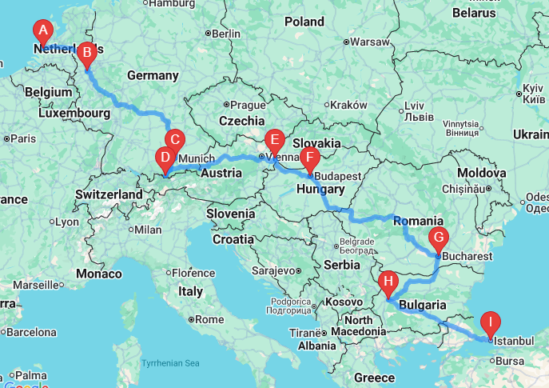
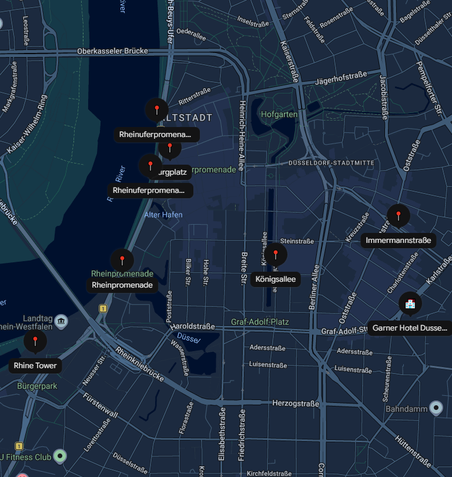
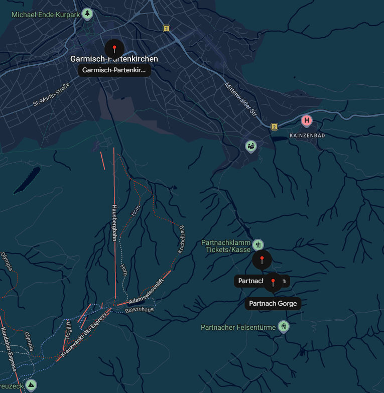
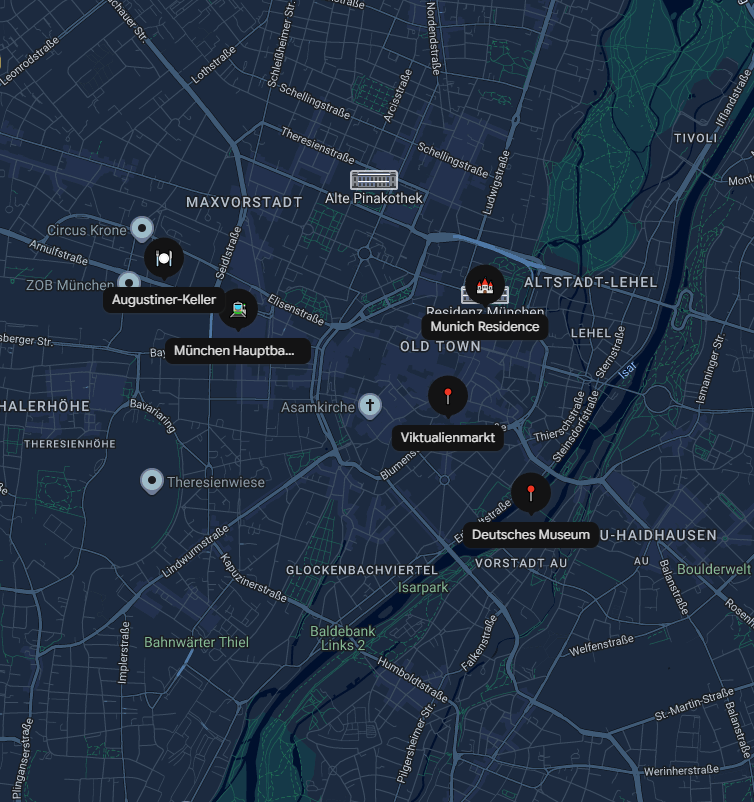
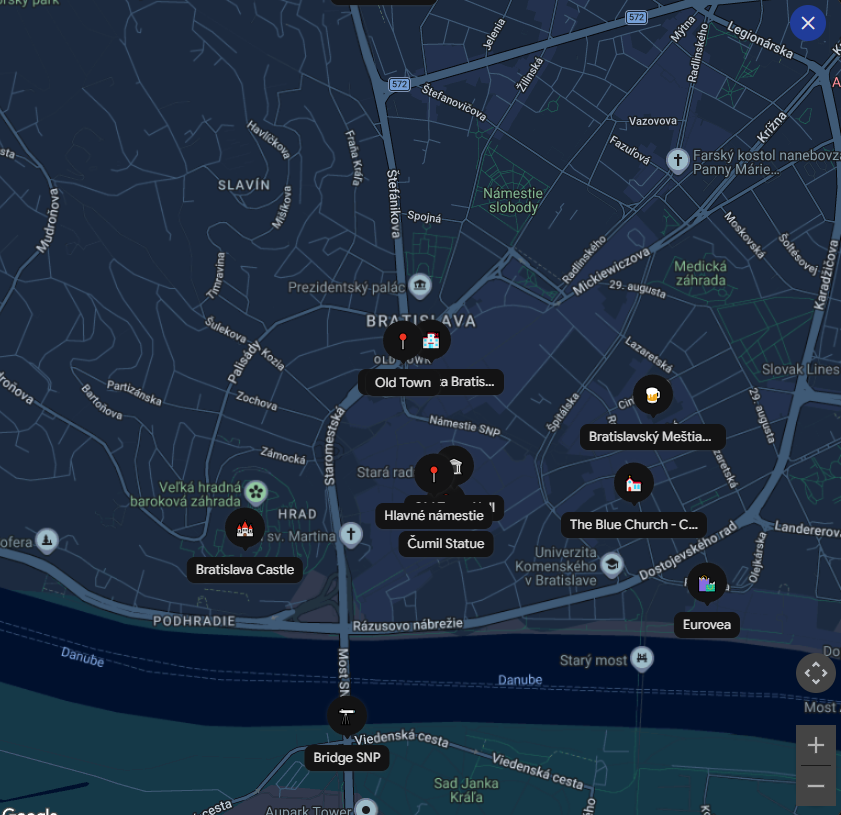
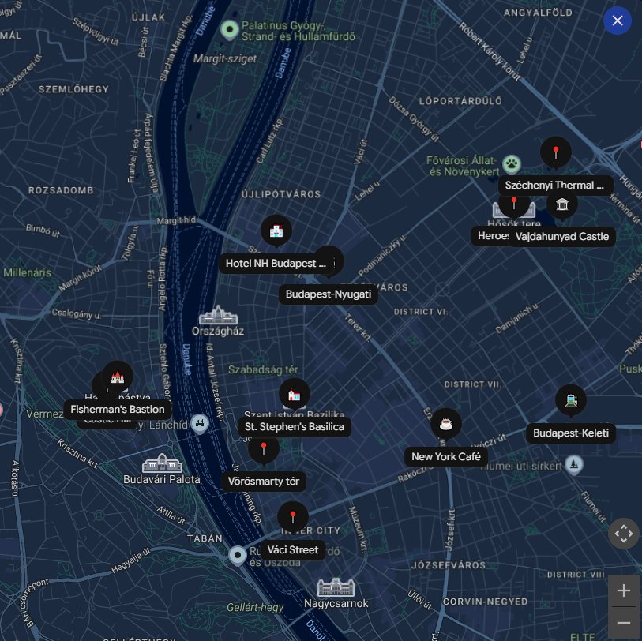
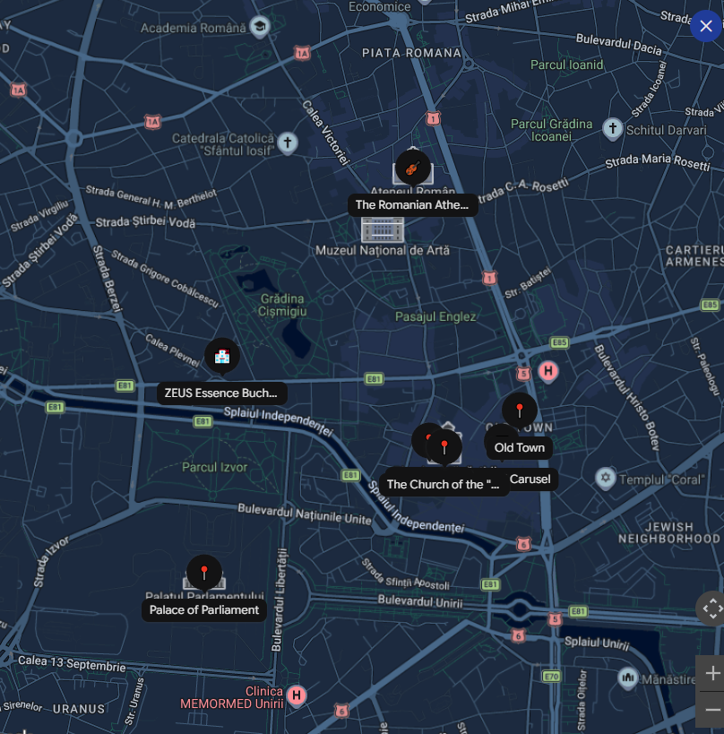
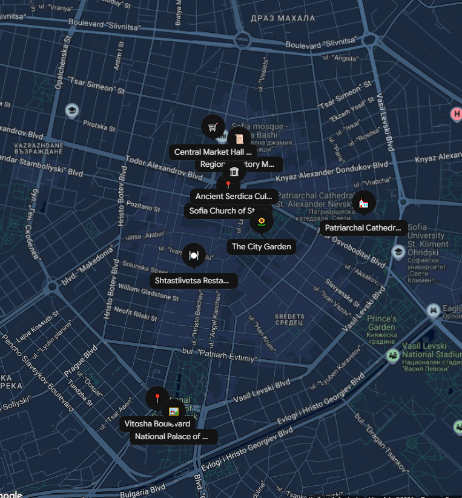
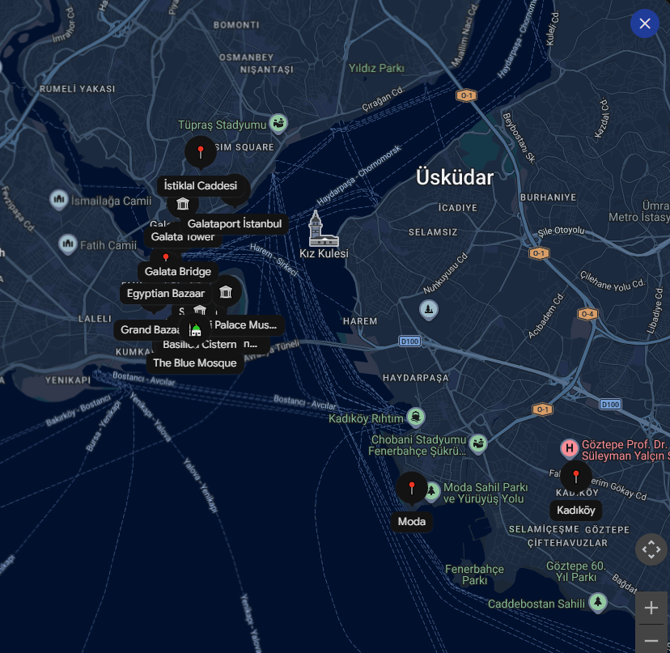

# 🗺️ 2026 Itinerary

| Stop | Destination                                   | Arrival Date         | Departure Date                 | Nights Stayed |
| ---- | --------------------------------------------- | -------------------- | ------------------------------ | ------------- |
| 1    | Delft (Netherlands)                           | Fri 17 Jul           | Fri 17 Jul                     | 0             |
| 2    | Düsseldorf (Germany)                          | Fri 17 Jul           | Sat 18 Jul                     | 1             |
| 3    | Munich (Germany)                              | Sat 18 Jul           | Tue 21 Jul                     | 3             |
| 4    | Garmisch-Partenkirchen (day trip from Munich) | Mon 20 Jul           | Mon 20 Jul                     | 0             |
| 5    | Bratislava (Slovakia)                         | Tue 21 Jul           | Thu 23 Jul                     | 2             |
| 6    | Budapest (Hungary)                            | Thu 23 Jul           | Fri 24 Jul (night train)       | 1             |
| 7    | Bucharest (Romania)                           | Sat 25 Jul (arrival) | Mon 27 Jul                     | 2             |
| 8    | Sofia (Bulgaria)                              | Mon 27 Jul           | Wed 29 Jul (night train)       | 2             |
| 9    | Istanbul (Turkey)                             | Thu 30 Jul (arrival) | Sun 2 Aug                      | 3             |

---

## 🇩🇪 Düsseldorf (Germany) | Fri 17 Jul – Sat 18 Jul

Delft $\rightarrow$ Duesseldorf Hbf 09:38 - 12:45

* **Duration:** 3h 7m (1 transfer)
* **Leg 1:** 09:38 Delft $\rightarrow$ 10:48 Utrecht Centraal (IC 3535, Open seating)
* **Transfer:** 14 mins at Utrecht Centraal
* **Leg 2:** 11:02 Utrecht Centraal $\rightarrow$ 12:45 Duesseldorf Hbf (ICE 123, **Reservation required**)

* **Hotel:** Garner Hotel Düsseldorf - Main Station by IHG.
* **Stop 1 – Little Tokyo:** Ramen, sushi, and bakeries along Immermannstraße (right by the station).
* **Stop 2 – Königsallee ("Kö"):** Scenic luxury canal walk shaded by massive chestnut trees.
* **Stop 3 – Altstadt & Burgplatz:** Cobblestone old town streets leading to the historic castle tower square.
* **Stop 4 – Rheinuferpromenade:** Car-free waterfront pedestrian stroll to watch the cargo ships pass.
* **Stop 5 – Rhine Tower (Rheinturm):** High-speed elevator up 240 meters for 360-degree skyline views.

---

## 🇩🇪 Munich (Germany) | Sat 18 Jul – Tue 21 Jul

Duesseldorf Hbf $\rightarrow$ Muenchen Hbf 10:22 - 15:12

* **Duration:** 4h 53m (direct)
* **Train:** ICE 623 (Operated by NS International)

* **Hotel:** H+ Muenchen.

### ☀️ **Option A: Clear Skies – Alpine Adventure (Garmisch-Partenkirchen)**

* **08:00** – Catch a direct regional train from München Hbf to Garmisch-Partenkirchen (~1h 20m).
* **Morning** – Board the historic **Bayerische Zugspitzbahn** cogwheel train and cable car to the summit of the **Zugspitze** ($2962\text{ m}$) for views across four countries.
* **Early Afternoon** – Take the **Cable Car Zugspitze** down to **Eibsee**, a crystal-clear, emerald-green alpine lake at the mountain's base. Stroll the flat lakeside path.
* **Late Afternoon** – Ride back down to town. Walk through the roaring waterfalls of **Partnach Gorge**, or view traditional painted houses (*Lüftlmalerei*) in Partenkirchen.
* *Ticket Tip: Use a **Bayern Ticket** or **Guten Tag Ticket** for cheap, flexible family regional travel.*

### ☁️/🌧️ **Option B: Rainy Day – Munich City Culture**

* **Morning** – Traditional Bavarian breakfast (Pretzels and *Weißwurst*) at **Viktualienmarkt**, followed by an indoor tour of the grand **Residenz** palace.
* **Afternoon** – Explore the **Deutsches Museum** on the Isar River—the world’s largest science and tech museum, featuring massive interactive halls on flight, space, and physics.
* **Evening** – Escape the damp weather with a warm, hearty dinner in a historic hall like **Augustiner-Keller**.

---

## 🇸🇰 Bratislava (Slovakia) | Tue 21 Jul – Thu 23 Jul

Muenchen Hbf Gl.5-10 $\rightarrow$ Bratislava Hlavna Stanica 10:21 - 16:10

* **Hotel:** Crowne Plaza BRATISLAVA by IHG

* **Duration:** 5h 49m (1 transfer)
* **Leg 1:** 10:21 Muenchen Hbf Gl.5-10 $\rightarrow$ 14:47 Wien Hbf (EC 1213, Reservation optional)
* **Transfer:** 27 mins at Wien Hbf
* **Leg 2:** 15:14 Wien Hbf $\rightarrow$ 16:10 Bratislava Hlavna Stanica (RE 2522, Open seating)

### **Day 1: Tuesday, 21 Jul – Arrival & Quirky Statues**

* **Afternoon** – Arrive at Bratislava Main Station from Munich via Interrail. Transit to your hotel.
* **16:00** – Walk the pedestrian **Old Town (Staré Mesto)** and hunt for the famous bronze **"Man at Work" (Čumil)** statue.
* **18:00** – Explore the Old Town Hall at the historic **Main Square**.
* **19:30** – Local Slovak dumplings (*Bryndzové Halušky*) for dinner at *Bratislavský Meštiansky Pivovar*.

### **Day 2: Wednesday, 22 Jul – Castles & UFO Views**

* **09:30** – Walk up the hill to **Bratislava Castle** for panoramic views overlooking the Danube.
* **13:00** – Relaxed lunch at a quiet old-town terrace café.
* **15:00** – Visit the whimsical, completely pastel-blue **St. Elizabeth's Church (The Blue Church)**.
* **17:30** – Ride the elevator up to the **"UFO" Observation Deck** atop the bridge for sunset views.
* **19:30** – Relaxing dinner along the Eurovea riverside promenade.

---

## 🇭🇺 Budapest (Hungary) | Thu 23 Jul – Fri 24 Jul (Night Train)

Bratislava Hlavna Stanica $\rightarrow$ Budapest-Nyugati 10:05 - 12:28

* **Duration:** 2h 23m (direct)
* **Train:** RJ 273 METROPOLITAN (Railjet, Operated by České dráhy, a.s.)

### **Day 1: Thursday, 23 Jul – Arrival & Illuminated River**

* **12:28** – Arrive at **Budapest-Nyugati** from Bratislava. Take the metro to check into **NH Budapest City**.
* **14:30** – Stroll through the lively pedestrian zones of **Vorosmarty Square** and **Váci utca**.
* **17:00** – Tour the magnificent grand interior of **St. Stephen’s Basilica**.
* **19:30** – **Danube Sightseeing Cruise:** Watch the Hungarian Parliament and Buda Castle illuminate brilliantly from the water.
* **21:00** – Casual dinner in the historic **Jewish Quarter**.

### **Day 2: Friday, 24 Jul – Castle District, Thermal Baths & Departure**

* **09:00** – Checkout and leave your suitcases in the NH Budapest City secure **luggage room**.
* **09:30** – Head up **Buda Castle Hill** to explore the fairy-tale towers of **Fisherman’s Bastion** and **Matthias Church**.
* **12:30** – Quick transit across Pest to **Heroes’ Square** and **Vajdahunyad Castle**.
* **13:30** – **Széchenyi Thermal Bath:** Enjoy a highly relaxing 2.5-hour soak in the outdoor thermal pools before your long train ride.
* **16:30** – Late dinner or coffee/cake inside the stunning, historic **New York Café** right next to your hotel.
* **17:45** – Collect your bags from the hotel lobby.
* **18:15** – Walk 10 minutes or take the metro 1 stop straight to **Keleti Station**.
* **19:10** – Board the **"Ister" Night Train** to Bucharest (private 3-bed family sleeper cabin).

---

## 🇷🇴 Bucharest | Sat 25 Jul – Mon 27 Jul

**Train:** Budapest-Keleti → București Nord
**Arrival:** Sat 25 Jul, 10:37

**Hotel:** Zeus Essence Bucharest Venezia

### Saturday 25 Jul

* Check in / lunch
* Palace of the Parliament (book ahead, bring passports)
* Stavropoleos Monastery
* Cărturești Carusel
* Old Town Bucharest
* Evening walk: Calea Victoriei & Romanian Athenaeum
* Dinner: Caru' cu bere

### Sunday 26 Jul

* Dimitrie Gusti National Village Museum
* King Michael I Park
* Afternoon at Therme Bucharest
* Dinner in the city center
* Piața Unirii Fountains (if running)

### Top Priorities

1. Palace of the Parliament
2. Old Town Bucharest
3. Calea Victoriei
4. Dimitrie Gusti National Village Museum
5. Therme Bucharest

That's essentially the "Bucharest greatest hits" album: one giant communist palace, one charming old quarter, one elegant boulevard, one slice of Romanian history, and one afternoon of thermal pools engineered to keep children from staging a rebellion.

---

## 🇧🇬 Sofia (Bulgaria) | Mon 27 Jul – Wed 29 Jul (Night Train)

Bucuresti Nord $\rightarrow$ Sofia 10:46 - 20:41

* **Duration:** 9h 55m (direct)
* **Train:** INT 461 International (Operated by Societatea Nationala de Transport Feroviar de Calatori)
* **Seating:** **Seat reservations required** (€6.00 for 2nd class)

### **Mon, 27 Jul – Departure & Arrival**

* **10:46** – Board direct train (INT 461) at **București Nord**.
* **20:41** – Arrive at **Sofia Central Station** and take the metro to your hotel.
* **Evening** – Late dinner and a stroll down pedestrianized **Vitosha Boulevard**.

### **Tue, 28 Jul – Old Sofia & Golden Domes**

* **Morning** – Visit the ancient **St. George Rotunda**, see the underground **Serdika Roman ruins**, and explore the **Regional History Museum** (former Central Baths).
* **Lunch** – Traditional Bulgarian dishes at *Shtastliveca Vitoshka*.
* **Afternoon** – Marvel at the gold-domed **St. Alexander Nevsky Cathedral** and relax in the **City Garden** by the National Theater.
* **Dinner** – Classic clay-pot dinner at a traditional tavern (*Mehana*).

### **Wed, 29 Jul – Parks, Markets & Night Train**

* **Morning** – Walk the wooded trails of **Borisova Gradina Park** and view the **National Palace of Culture (NDK)** plaza.
* **Afternoon** – Stock up on travel snacks (like *banitsa* and *lukanka*) at the **Central Market Hall (Halite)** and collect your bags.
* **Evening** – Head to the Central Station to board your international night train.

---

## 🇹🇷 Istanbul (Turkey) | Thu 30 Jul – Sun 2 Aug

Sofia $\rightarrow$ İstanbul (Halkalı) 18:50 - 09:56
https://ebilet.tcddtasimacilik.gov.tr/sefer-listesi

* **Duration:** 15h 6m (direct overnight train)

### **Day 1: Thu, 30 Jul – Imperial Heart & Underground Wonders**

* **09:56** – Arrive at Istanbul Halkalı Station on the night train. Take the direct **Marmaray** commuter rail straight to the historic center (Sirkeci/Sultanahmet). Drop bags at your hotel.
* **13:30** – Stand inside the jaw-dropping **Hagia Sophia** and cross the main square to view the historic cascading domes of the **Blue Mosque**.
* **16:00** – Descend into the **Basilica Cistern**, an atmospheric 6th-century Roman reservoir featuring beautifully lit columns and mysterious Medusa head carvings.
* **19:30** – Dinner in Sultanahmet trying local *Sultanahmet Köftesi* (traditional grilled meatballs).

### **Day 2: Fri, 31 Jul – Sultans, Grand Bazaars & Spices**

* **09:00** – Explore **Topkapı Palace**, the sprawling cliffside home of the Ottoman Sultans. Tour the beautiful maze of the *Harem* and the Imperial Treasury.
* **13:30** – Walk through the bustling historic tunnels of the **Grand Bazaar** and the neighboring **Spice Market** (perfect for picking up authentic Turkish Delight).
* **16:30** – Cross the **Galata Bridge** on foot to watch hundreds of local fishermen casting lines over the water.
* **18:30** – Take the elevator up the medieval stone **Galata Tower** for a 360° panoramic sunset view of the golden city.

### **Day 3: Sat, 1 Aug – Intercontinental Ferry & Asian Side**

* **10:00** – Catch a public zig-zag **Bosphorus Ferry** from Eminönü pier. It’s an incredibly relaxing, cheap boat ride that cruises between Europe and Asia past fortresses and palaces.
* **12:00** – Hop off on the **Asian Side (Kadıköy)**. Explore its vibrant local food markets and street art.
* **15:00** – Take a relaxed seaside stroll down the promenade in the trendy neighborhood of **Moda**.
* **18:30** – Ferry back to the European side to enjoy a final seaside dinner at the ultra-modern **Galataport** waterfront.

### **Day 4: Sun, 2 Aug – Tram Ride & Flight to Beijing**

* **09:30** – Pack up and check out of your hotel. Stroll down pedestrian **Istiklal Avenue** to see the iconic vintage red tram.
* **11:15** – Early lunch or grab hot, fresh *Simit* (sesame bread rings) from a street cart. Collect your suitcases from the hotel.
* **12:00 – DEPART FOR AIRPORT:** Take a pre-booked taxi/private shuttle or the direct **Havaist Airport Bus** from Sultanahmet straight to Istanbul Airport (IST).
* **13:00** – Arrive at the airport **2.5 hours early** to comfortably clear Istanbul’s strict double-security screening for your **15:30 flight** back home to Beijing!

---

> **🎒 Luggage & Transit Tip:** Istanbul Airport (IST) is vast and requires a lot of walking inside the terminal. Booking a private airport shuttle from your hotel lobby at 12:00 is the most seamless, stress-free choice for a family traveling with international flight luggage.

## 🎫 Category 1: Train Passes & Seat Reservations (Interrail Extensions)

* **Delft $\rightarrow$ Düsseldorf (Fri 17 Jul):** ICE 123 Seat Reservation (Utrecht $\rightarrow$ Düsseldorf). Use `bahn.de` and select "Seat only". *Cost: €5.50 per seat.*
* **Düsseldorf $\rightarrow$ Munich (Sat 18 Jul):** ICE 623 Seat Reservation. Use `bahn.de` and select "Seat only". *Cost: €5.50 per seat.*
* **Munich $\rightarrow$ Garmisch-Partenkirchen Day Trip (Mon 20 Jul):** Regio-Ticket Werdenfels. Buy on the DB Navigator app. This out-of-pocket regional ticket allows Joey to travel entirely for free and saves an Interrail day! *Cost: ~€34 total for the family.*
* **Munich $\rightarrow$ Bratislava (Tue 21 Jul):** EC 1213 Seat Reservation (Munich $\rightarrow$ Vienna). Use `oebb.at` and select "Seat only". *Cost: €3.00 per seat.*
* **Bratislava $\rightarrow$ Budapest (Thu 23 Jul):** Point-to-Point Train Ticket. Buy via `zssk.sk` or `jegy.mav.hu` for the EuroCity *Metropolitan* train to save your final Interrail pass day. *Cost: ~€30–€40 total.*
* **Budapest $\rightarrow$ Bucharest Night Train (Fri 24 Jul):** Private 3-Bed Sleeper Cabin ("Triple") on the *Ister* Night Train. Book via `jegy.mav.hu`, applying your Interrail pass number to pay only the cabin reservation supplement. *Cost: ~€84 total.*
* **Bucharest $\rightarrow$ Sofia (Mon 27 Jul):** Mandatory Seat Reservation for the INT 461 International train. Book via the official Eurail/Interrail website's Self-Service portal. *Cost: €6.00 per seat.*
* **Sofia $\rightarrow$ Istanbul Night Train (Wed 29 Jul):** Private 1st Class 2-Bed or 3-Bed Sleeper Reservation on the *Sofia-Istanbul Express*. Cannot be bought online. Secure it physically at Bucharest Nord station when you arrive on July 25th, or book ahead via a regional rail agency (like RILA travel). *Cost: ~€10–€15 per berth supplement.*

---

## 🏛️ Category 2: Sights & Activities (High-Demand)

* **Budapest – Danube Sightseeing Cruise (Thu 23 Jul):** Evening cruise ticket. Book online via *Legenda Cruises* or similar to guarantee open-deck seating for the Parliament illumination.
* **Budapest – New York Café (Fri 24 Jul @ 16:30):** Table reservation. Book directly via `newyorkcafe.hu` to avoid a 45+ minute queue before your night train.
* **Bucharest – Palace of the Parliament (Sat 25 Jul):** Guided Tour Ticket. Guided entry is legally mandatory and caps fill up fast. Book 1–2 weeks ahead on their official site. *(Note: Must bring physical passports to enter).*
* **Bucharest – Therme Bucharest (Sun 26 Jul):** Timed entry ticket. Book directly from their official website to skip the brutal summer ticketing queue at the entrance.
* **Istanbul – Hagia Sophia (Thu 30 Jul):** Official Skip-the-Line Entry Ticket. Buy via the official Turkish Ministry of Tourism portal. Skip the ticketing queue entirely to enter the upper tourist gallery. Joey is 12, so he requires a standard ticket. *Cost: €25 per person.*
* **Istanbul – Basilica Cistern (Thu 30 Jul):** Timed Mobile Entry Ticket. Book online a few days ahead to sail right past the ticket window queues on the pavement. *Cost: ~1,950 TL (~€39) per person.*

To make this incredible rail expedition run completely seamlessly, here is the exact list of non-obvious gear, specific packing rules, and physical items you need to prepare before you leave Delft.

---

## 🎒 1. Mandatory Gear for the Night Trains

European night trains are an adventure, but the cabins do not function like hotel rooms. You must pack a small, dedicated **"Night Train Daypack"** for the family so you don't have to crack open your large suitcases in the cramped sleeper compartments:

* **A Power Strip / Multi-Plug Adapter:** Sleeper cabins (especially on the *Ister* to Bucharest and the *Sofia-Istanbul Express*) usually only have **one single plug socket** for the whole compartment. Bring a small extension cord or multi-USB block so all three of you can charge your phones and devices overnight.
* **Flip-Flops / Slipper Shoes:** You will need these to comfortably walk down the corridor to the shared train toilets in the middle of the night without having to lace up your walking shoes.
* **Wet Wipes & Dry Tissues:** Train bathrooms regularly run out of toilet paper and running water by 4:00 AM. Having wet wipes and pocket tissues handy is a lifesaver.
* **A Power Bank:** Just in case the single socket in your cabin is broken or lacks power (which happens occasionally on older Balkan rolling stock).

---

## 👙 2. Strict Dressing Packing List for Therme Bucharest & Mosques

Two stops on your trip have incredibly strict, legally enforced clothing rules that will ruin your day if ignored.

### For Therme Bucharest (Sun 26 Jul):

* **Clean Flip-Flops/Slippers:** You are **strictly forbidden** from walking inside the spa barefoot or in shoes you wore outside. You must pack a dedicated pair of clean flip-flops for each family member that you *only* put on inside the changing room.
* **Towels:** While you can rent towels there for a fee (~31 RON / €6), packing your own lightweight microfiber travel towels saves you money and checkout time.
* **Zone Age Limit Note:** Because Joey is 12, your family will spend your time in the **Galaxy Zone** (the massive family slide and wave pool area). The *Palm* and *Elysium* wellness zones are strictly restricted to guests aged 14 and above.

### For the Istanbul Mosques (Thu 30 Jul):

* **Modest Clothes:** No shorts, short skirts, or sleeveless tank tops are allowed for adults or teens. Pack lightweight linen trousers or long jeans for yourself, your wife, and Joey for this day.
* **A Headscarf:** Your wife must cover her hair completely to enter Hagia Sophia and the Blue Mosque. Pack a light, easily packable scarf in her daypack.

---

## 📁 3. Physical Documents & Passport Copies

Because you are crossing multiple non-Schengen zones and taking land trains, do not rely entirely on your phones.

* **Physical Chinese Passports + Dutch Resident Cards:** Keep these together in a secure, RFID-blocking neck pouch or waist money belt. You will need them to cross into Romania, Bulgaria, and Türkiye, and you **must present physical passports** to enter the Palace of the Parliament in Bucharest.
* **Printed Copies of Train Pass/Reservations:** Print out physical paper copies of your Interrail pass cover sheet, your *Ister* sleeper reservation, and your Istanbul train reservation. If your phone battery dies during a 15-hour overnight transit, a physical paper backup keeps train conductors happy.

---

## 📱 4. Mobile Apps to Download Right Now

Download these apps while you are still in Delft and set up your ABN AMRO card profiles in them ahead of time:

* **DB Navigator (Germany):** For tracking platform changes in Düsseldorf and activating your Garmisch regional pass.
* **BudapestGO (Hungary):** To purchase your 24-hour family group transit pass digitally.
* **Yellow Taxi / Taxime (Bulgaria):** The safest, official apps to call metered taxis in Sofia to avoid tourist taxi scams at the central station.
* **BiTaksi (Türkiye):** Istanbul’s primary taxi-hailing app, which routes metered rides directly to your phone.