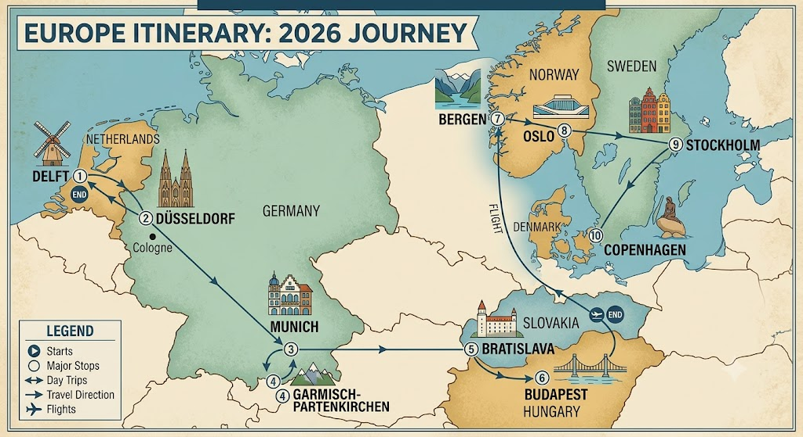

# 🗺️ 2026 Itinerary

| Stop | Destination | Arrival Date | Departure Date | Nights Stayed |
| --- | --- | --- | --- | --- |
| 1   | Delft (Netherlands) | Fri 17 Jul | Fri 17 Jul | 0 |
| 2   | Düsseldorf (Germany) | Fri 17 Jul | Sat 18 Jul | 1 |
| 3 | Munich (Germany) | Sat 18 Jul | Tue 21 Jul | 3 |
| 4 | Garmisch-Partenkirchen (day trip) | Mon 20 Jul | Mon 20 Jul | 0 |
| 5 | Bratislava (Slovakia) | Tue 21 Jul | Thu 23 Jul | 2 |
| 6 | Budapest (Hungary) | Thu 23 Jul | Fri 24 Jul (flight) | 1 |
| 7 | Bergen     | Fri 24 Jul  | Sun 26 Jul | **2**     |
| 8 | Oslo       | Sun 26 Jul  | Tue 28 Jul | **2**     |
| 9 | Stockholm  | Tue 28 Jul  | Fri 31 Jul | **3**     |
| 10 | Copenhagen | Fri 31 Jul  | Sun 2 Aug (flight)  | **2**     |
| 11 | **Delft (Netherlands)** | **Sun 2 Aug** | — | — |

---

## 🇩🇪 Düsseldorf (Germany) | Fri 17 Jul – Sat 18 Jul

Delft $\rightarrow$ Duesseldorf Hbf 09:38 - 12:45

* **Duration:** 3h 7m (1 transfer)
* **Leg 1:** 09:38 Delft $\rightarrow$ 10:48 Utrecht Centraal (IC 3535, Open seating)
* **Transfer:** 14 mins at Utrecht Centraal
* **Leg 2:** 11:02 Utrecht Centraal $\rightarrow$ 12:45 Duesseldorf Hbf (ICE 123, **Reservation required**)

* **Hotel:** Garner Hotel Düsseldorf - Main Station by IHG.
* **Stop 1 – Little Tokyo:** Ramen, sushi, and bakeries along Immermannstraße (right by the station).
* **Stop 2 – Königsallee ("Kö"):** Scenic luxury canal walk shaded by massive chestnut trees.
* **Stop 3 – Altstadt & Burgplatz:** Cobblestone old town streets leading to the historic castle tower square.
* **Stop 4 – Rheinuferpromenade:** Car-free waterfront pedestrian stroll to watch the cargo ships pass.
* **Stop 5 – Rhine Tower (Rheinturm):** High-speed elevator up 240 meters for 360-degree skyline views.

---

## 🇩🇪 Munich (Germany) | Sat 18 Jul – Tue 21 Jul

Duesseldorf Hbf $\rightarrow$ Muenchen Hbf 10:22 - 15:12

* **Duration:** 4h 53m (direct)
* **Train:** ICE 623 (Operated by NS International)

* **Hotel:** H+ Muenchen.

### ☀️ **Option A: Clear Skies – Alpine Adventure (Garmisch-Partenkirchen)**

* **08:00** – Catch a direct regional train from München Hbf to Garmisch-Partenkirchen (~1h 20m).
* **Morning** – Board the historic **Bayerische Zugspitzbahn** cogwheel train and cable car to the summit of the **Zugspitze** ($2962\text{ m}$) for views across four countries.
* **Early Afternoon** – Take the **Cable Car Zugspitze** down to **Eibsee**, a crystal-clear, emerald-green alpine lake at the mountain's base. Stroll the flat lakeside path.
* **Late Afternoon** – Ride back down to town. Walk through the roaring waterfalls of **Partnach Gorge**, or view traditional painted houses (*Lüftlmalerei*) in Partenkirchen.
* *Ticket Tip: Use a **Bayern Ticket** or **Guten Tag Ticket** for cheap, flexible family regional travel.*

### ☁️/🌧️ **Option B: Rainy Day – Munich City Culture**

* **Morning** – Traditional Bavarian breakfast (Pretzels and *Weißwurst*) at **Viktualienmarkt**, followed by an indoor tour of the grand **Residenz** palace.
* **Afternoon** – Explore the **Deutsches Museum** on the Isar River—the world’s largest science and tech museum, featuring massive interactive halls on flight, space, and physics.
* **Evening** – Escape the damp weather with a warm, hearty dinner in a historic hall like **Augustiner-Keller**.

---

## 🇸🇰 Bratislava (Slovakia) | Tue 21 Jul – Thu 23 Jul

Muenchen Hbf Gl.5-10 $\rightarrow$ Bratislava Hlavna Stanica 10:21 - 16:10

* **Hotel:** Crowne Plaza BRATISLAVA by IHG

* **Duration:** 5h 49m (1 transfer)
* **Leg 1:** 10:21 Muenchen Hbf Gl.5-10 $\rightarrow$ 14:47 Wien Hbf (EC 1213, Reservation optional)
* **Transfer:** 27 mins at Wien Hbf
* **Leg 2:** 15:14 Wien Hbf $\rightarrow$ 16:10 Bratislava Hlavna Stanica (RE 2522, Open seating)

### **Day 1: Tuesday, 21 Jul – Arrival & Quirky Statues**

* **Afternoon** – Arrive at Bratislava Main Station from Munich via Interrail. Transit to your hotel.
* **16:00** – Walk the pedestrian **Old Town (Staré Mesto)** and hunt for the famous bronze **"Man at Work" (Čumil)** statue.
* **18:00** – Explore the Old Town Hall at the historic **Main Square**.
* **19:30** – Local Slovak dumplings (*Bryndzové Halušky*) for dinner at *Bratislavský Meštiansky Pivovar*.

### **Day 2: Wednesday, 22 Jul – Castles & UFO Views**

* **09:30** – Walk up the hill to **Bratislava Castle** for panoramic views overlooking the Danube.
* **13:00** – Relaxed lunch at a quiet old-town terrace café.
* **15:00** – Visit the whimsical, completely pastel-blue **St. Elizabeth's Church (The Blue Church)**.
* **17:30** – Ride the elevator up to the **"UFO" Observation Deck** atop the bridge for sunset views.
* **19:30** – Relaxing dinner along the Eurovea riverside promenade.

---

## 🇭🇺 Budapest (Hungary) | Thu 23 Jul – Fri 24 Jul (Night Train)

Bratislava Hlavna Stanica $\rightarrow$ Budapest-Nyugati 10:05 - 12:28

* **Duration:** 2h 23m (direct)
* **Train:** RJ 273 METROPOLITAN (Railjet, Operated by České dráhy, a.s.)

### **Day 1: Thursday, 23 Jul – Arrival & Illuminated River**

* **12:28** – Arrive at **Budapest-Nyugati** from Bratislava. Take the metro to check into **NH Budapest City**.
* **14:30** – Stroll through the lively pedestrian zones of **Vorosmarty Square** and **Váci utca**.
* **17:00** – Tour the magnificent grand interior of **St. Stephen’s Basilica**.
* **19:30** – **Danube Sightseeing Cruise:** Watch the Hungarian Parliament and Buda Castle illuminate brilliantly from the water.
* **21:00** – Casual dinner in the historic **Jewish Quarter**.

### **Day 2: Friday, 24 Jul – Castle District, Thermal Baths & Departure**

* **09:00** – Checkout and leave your suitcases in the NH Budapest City secure **luggage room**.
* **09:30** – Head up **Buda Castle Hill** to explore the fairy-tale towers of **Fisherman’s Bastion** and **Matthias Church**.
* **12:30** – Quick transit across Pest to **Heroes’ Square** and **Vajdahunyad Castle**.
* **13:30** – **Széchenyi Thermal Bath:** Enjoy a highly relaxing 2.5-hour soak in the outdoor thermal pools before your long train ride.
* **16:30** – Late dinner or coffee/cake inside the stunning, historic **New York Café** right next to your hotel.
* **17:45** – Collect your bags from the hotel lobby.
* **18:15** – Walk 10 minutes or take the metro 1 stop straight to **Keleti Station**.
* **19:10** – Board the **"Ister" Night Train** to Bucharest (private 3-bed family sleeper cabin).

---

## 🇳🇴 Bergen | Fri 24 Jul – Sun 26 Jul

Fri, Jul 24 11:20 AM – 2:05 PM

### Friday 24 Jul

* Arrival
* Bryggen
* Fish Market
* Harbor evening walk

### Saturday 25 Jul

* Mostraumen Fjord Cruise
* Fløibanen
* Mount Fløyen
* Dinner

### Sunday 26 Jul

* Relaxed breakfast around Bryggen
* Scenic Bergensbanen to Oslo

## 🇳🇴 Oslo | Sun 26 Jul – Tue 28 Jul

Sunday, 26 July 08:08 Bergen stasjon 15:09 Oslo S

### Day 1: Sunday

* Arrive from Bergen
* Oslo Opera House
* Bjørvika waterfront
* Aker Brygge
* Mathallen dinner

### Day 2: Monday

* Fram Museum
* Vigeland Park
* Akershus Fortress

## 🇸🇪 Stockholm | Tue 28 Jul – Fri 31 Jul

Oslo S Stockholm Central  07:27 - 13:20

### Day 1: Tuesday

* Arrive from Oslo
* Gamla Stan
* Royal Palace
* Fika

### Day 2: Wednesday

* Vasa Museum
* Skansen
* Djurgården stroll
* Evening boat tour

### Day 3: Thursday (new day)

#### Option A (my recommendation)

* Stockholm City Hall
* Ferry to Södermalm
* Monteliusvägen viewpoint
* Relaxed exploration of the waterfront districts

#### Option B (for Joey)

* ABBA Museum
* Junibacken children's museum
* More time at Djurgården

## 🇩🇰 Copenhagen (Denmark) | Fri 31 Jul – Sun 2 Aug

**Stockholm Central $\rightarrow$ København H | 08:20 - 13:23**

* **Duration:** 5h 3m (Direct high-speed SJ X2000 train)
* **Highlight:** Crossing the iconic **Øresund Bridge** connecting Sweden and Denmark over the ocean.

### **Day 1: Friday, 31 Jul – Fairytale Canals & Magical Amusement Parks**

* **13:30** – Arrive at Copenhagen Central Station (*København H*) and drop your bags off.
* **14:30** – Stroll through the iconic, postcard-perfect canal harbor of **Nyhavn** to view the historic 17th-century townhouses.

* **16:00** – Spend a magical late afternoon and evening inside Tivoli Gardens, one of the world's oldest amusement parks. The combination of vintage roller coasters, lush gardens, and thousands of twinkling fairy lights is spectacular for an evening visit.
* **19:30** – Dine inside the park or grab traditional open-faced rye sandwiches (*Smørrebrød*) nearby.

### **Day 2: Saturday, 1 Aug – Royal Palaces, Science, & Waterfront Biking**

* **09:30** – Start the morning at Amalienborg Palace to view the royal residences and the waterfront harbor park.
* **11:00** – Walk down the pedestrian promenade to see the historic Little Mermaid statue and the historic star-shaped fortress of Kastellet.
* **13:00** – Head over to the ultra-modern **Experimentarium** science center, a multi-story playground of interactive physics, water mechanics, and light experiments designed perfectly for curious kids.
* **16:30** – Climb the unique spiral equestrian ramp inside the Round Tower (*Rundetårn*) for panoramic views over the city's red-tiled roofs.

### **Day 3: Sunday, 2 Aug – Final Morning & Return Flight Home**

* **09:00** – Pick up fresh Danish pastries from a local bakery like *Sankt Peders Bageri*.
* **10:30** – Take a short 15-minute regional train ride directly from Central Station to Copenhagen Airport (CPH).
* **Afternoon** – Flight back to the Netherlands, landing and taking a quick train straight back to **Delft** to conclude the journey!