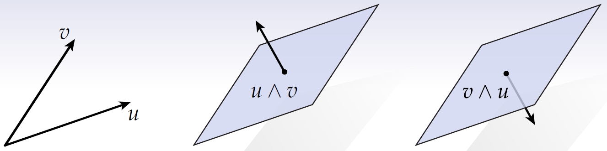
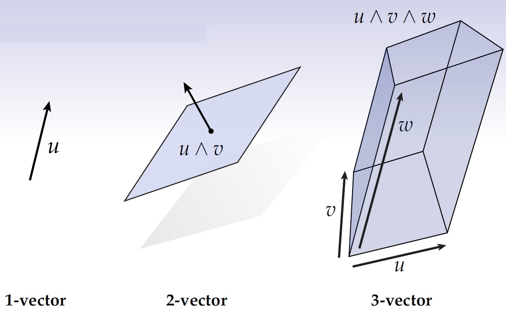
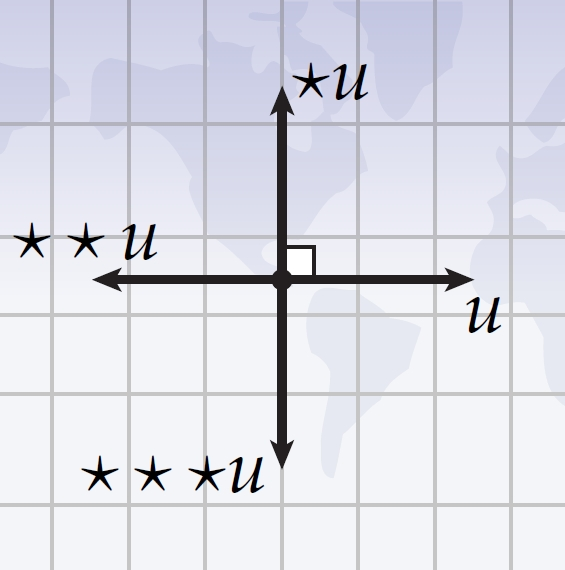
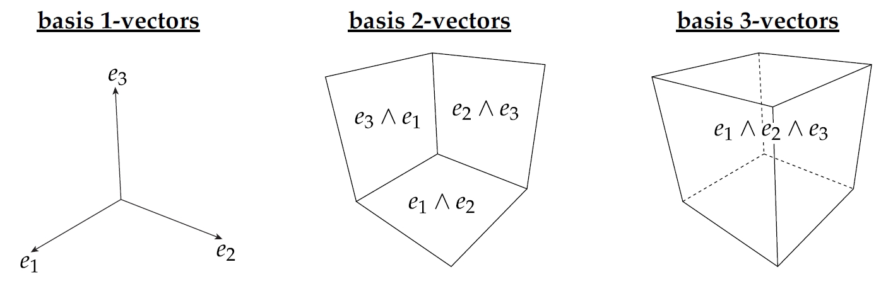

### **外代数：几何计算的框架**

外代数 (Exterior Algebra) 提供了一个强大的数学框架，用于理解和操作高维空间中的几何对象，如体积、面积和方向 (orientation)。本文探讨了三个关键概念：**wedge product**（楔积）、**Hodge star** 和 **coordinate representation**（坐标表示），并揭示它们如何帮助我们表达和计算带符号的体积及其正交补。

---

### **1. 楔积：构造有向的 k-向量**

**wedge product** 是外代数的核心工具，能够通过组合向量来构建高维几何对象。

#### **Span**

Span（张成）的概念是理解楔积的基础。给定一组向量，**span** 是所有可能线性组合的集合：

$$
\text{span}\{\mathbf{v}_1, \mathbf{v}_2, \dots, \mathbf{v}_k\} = \{a_1\mathbf{v}_1 + a_2\mathbf{v}_2 + \dots + a_k\mathbf{v}_k \mid a_i \in \mathbb{R}\}.
$$

从几何上看，span 定义了这些向量生成的子空间。例如：

- 单个向量的 span 是一条直线。
- 两个线性无关向量的 span 是一个平面。

#### **定义**

楔积 $$ \mathbf{u} \wedge \mathbf{v} $$ 表示由 $$ \mathbf{u} $$ 和 $$ \mathbf{v} $$ 张成的平行四边形的带符号、有方向的面积。更一般地说，$$ k $$ 个向量的楔积表示一个 $$ k $$ 维体积。

#### **反对称性 (Antisymmetry)**

- 交换向量顺序会反转方向：$$ \mathbf{u} \wedge \mathbf{v} = -\mathbf{v} \wedge \mathbf{u} $$。
- 如果两个向量平行，它们的楔积为零，因为它们无法张成更高维的体积。

#### **k-向量**

**k-向量 (k-vector)** 是 $$ k $$ 个向量的楔积，表示一个具有方向的几何量。例如：

- **0-向量** 是标量 (scalar)。
- **1-向量** 是普通向量。
- **2-向量** 表示有方向的面积。
- **3-向量** 表示有方向的体积。

#### **几何解释**

楔积 $$ \mathbf{u} \wedge \mathbf{v} $$ 同时编码了由 $$ \mathbf{u} $$ 和 $$ \mathbf{v} $$ 构成的平行四边形的大小和方向。其中方向由向量的顺序决定。

---

### **2. Hodge 星算子：正交补与对偶性** 

**Hodge 星算子 (Hodge star)** 通过将一个 k-向量映射到其在向量空间中的正交补，补充了楔积的功能。

#### **正交补 (Orthogonal Complement)**

向量空间 $$ V $$ 中子空间 $$ W $$ 的**正交补**由 $$ V $$ 中与 $$ W $$ 的所有向量正交的向量组成：

$$
W^\perp = \{\mathbf{v} \in V \mid \langle \mathbf{v}, \mathbf{w} \rangle = 0 \ \text{for all } \mathbf{w} \in W\},
$$

其中 $$ \langle \cdot, \cdot \rangle $$ 是内积 (inner product)。

从几何角度看，正交补表示子空间中未包含的部分。例如：

- 在 3D 空间中，平面的正交补是一条垂直于该平面的直线。
- 在 2D 空间中，直线的正交补是另一条与之垂直的直线。

#### **Hodge 星算子**

**Hodge 星算子**将一个 k-向量映射到其 $$(n-k)$$-向量的正交补，其中 $$ n $$ 是空间的维数。该映射依赖于空间的内积结构。

#### **主要性质**

- **带符号的补集 (Signed Complement)**: Hodge 星算子将一个 k-向量变换为一个保留方向的补充体积。
- **双星性质 (Double Star)**: 连续应用 Hodge 星算子两次，将得到原向量的一个标量倍数：

  $$
  \star (\star \mathbf{v}) = (-1)^{k(n-k)} \mathbf{v}.
  $$

#### **几何示例**

在 3D 空间中：

- 一个 1-向量（直线）的 Hodge 星是一个 2-向量（与该直线正交的平面）。
- 一个 2-向量（平面）的 Hodge 星是一个 1-向量（与该平面正交的直线）。

#### **应用**

Hodge 星算子连接了楔积和对偶性，常用于以下场景：

1. 使用楔积计算 k-向量的带符号体积。
2. 应用 Hodge 星算子找到其正交的 $$(n-k)$$-向量。

例如，在 3D 空间中，楔积 $$ \mathbf{u} \wedge \mathbf{v} $$ 生成一个表示平面的 2-向量，而 Hodge 星算子将其变换为垂直于该平面的向量。

---

### **3. 坐标表示**

外代数通过基元素表达向量及其组合，实现其强大的计算能力。本节讨论基 k-向量的构造，以及 **Hodge 星算子 (Hodge star)** 在互补维度之间的映射，并通过一个涉及楔积和面积的示例加以说明。

#### **基向量与 k-向量**

**基 1-向量 (Basis 1-Vectors)**:

在 $$ \mathbb{R}^n $$ 中，基 1-向量 $$ \{\mathbf{e}_1, \mathbf{e}_2, \dots, \mathbf{e}_n\} $$ 是标准单位向量，张成整个空间。任意向量 $$ \mathbf{v} $$ 可表示为：

$$
\mathbf{v} = v_1 \mathbf{e}_1 + v_2 \mathbf{e}_2 + \dots + v_n \mathbf{e}_n,
$$

其中 $$ v_i $$ 是标量系数。

**基 2-向量 (Basis 2-Vectors)**:

2-向量是两个基 1-向量的楔积，如 $$ \mathbf{e}_i \wedge \mathbf{e}_j $$（其中 $$ i < j $$）。这些表示两个向量所张成的平面中的有向面积。在 $$ \mathbb{R}^3 $$ 中，有 $$ \binom{3}{2} = 3 $$ 个基 2-向量：

$$
\{\mathbf{e}_1 \wedge \mathbf{e}_2, \mathbf{e}_1 \wedge \mathbf{e}_3, \mathbf{e}_2 \wedge \mathbf{e}_3\}.
$$

**基 3-向量 (Basis 3-Vectors)**:

3-向量是三个基 1-向量的楔积，表示有向体积。在 $$ \mathbb{R}^3 $$ 中，最多有一个基 3-向量（考虑缩放因素）：

$$
\mathbf{e}_1 \wedge \mathbf{e}_2 \wedge \mathbf{e}_3.
$$

**一般基 k-向量 (General Basis k-Vectors)**:

在 $$ \mathbb{R}^n $$ 中，基 k-向量是 $$ k $$ 个不同基 1-向量的楔积：

$$
\mathbf{e}_{i_1} \wedge \mathbf{e}_{i_2} \wedge \dots \wedge \mathbf{e}_{i_k}, \quad 1 \leq i_1 < i_2 < \dots < i_k \leq n.
$$

基 k-向量的总数是 $$ \binom{n}{k} $$，即从 $$ n $$ 个向量中选择 $$ k $$ 个的组合数。

#### **Hodge 星算子与基 k-向量**

**Hodge 星算子**将 $$ \mathbb{R}^n $$ 中的基 k-向量映射到其互补的 $$(n-k)$$-向量。例如，在 $$ \mathbb{R}^3 $$ 中：

- **基 1-向量的 Hodge 星**映射到基 2-向量：

  $$
  \star \mathbf{e}_1 = \mathbf{e}_2 \wedge \mathbf{e}_3, \quad
  \star \mathbf{e}_2 = \mathbf{e}_3 \wedge \mathbf{e}_1, \quad
  \star \mathbf{e}_3 = \mathbf{e}_1 \wedge \mathbf{e}_2.
  $$

- **基 2-向量的 Hodge 星**映射到基 1-向量：

  $$
  \star (\mathbf{e}_1 \wedge \mathbf{e}_2) = \mathbf{e}_3, \quad
  \star (\mathbf{e}_2 \wedge \mathbf{e}_3) = \mathbf{e}_1, \quad
  \star (\mathbf{e}_3 \wedge \mathbf{e}_1) = \mathbf{e}_2.
  $$

- **基 3-向量的 Hodge 星**映射到标量 (0-向量)：

  $$
  \star (\mathbf{e}_1 \wedge \mathbf{e}_2 \wedge \mathbf{e}_3) = 1.
  $$

#### **示例：楔积与面积**

为了说明楔积与面积的关系，考虑 $$ \mathbb{R}^3 $$ 中的两个向量：  
$$ \mathbf{u} = u_1 \mathbf{e}_1 + u_2 \mathbf{e}_2 + u_3 \mathbf{e}_3 $$ 和  
$$ \mathbf{v} = v_1 \mathbf{e}_1 + v_2 \mathbf{e}_2 + v_3 \mathbf{e}_3 $$。

它们的楔积 $$ \mathbf{u} \wedge \mathbf{v} $$ 展开为：

$$
\mathbf{u} \wedge \mathbf{v} =
(u_1 v_2 - u_2 v_1) \mathbf{e}_1 \wedge \mathbf{e}_2 +
(u_2 v_3 - u_3 v_2) \mathbf{e}_2 \wedge \mathbf{e}_3 +
(u_3 v_1 - u_1 v_3) \mathbf{e}_3 \wedge \mathbf{e}_1.
$$

系数 $$ u_i v_j - u_j v_i $$ 表示平行四边形在坐标平面上的投影面积的带符号大小。$$ \mathbf{u} \wedge \mathbf{v} $$ 的大小给出了整个平行四边形的面积，而方向由基 2-向量编码。

---

外代数以系统且优雅的方式描述和计算几何对象，使其成为物理学、几何学和计算机图形学等领域的基础工具。