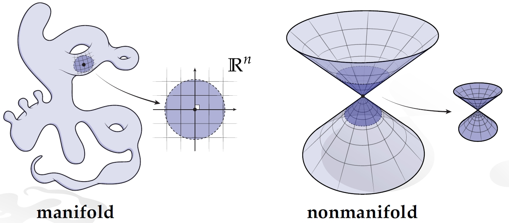
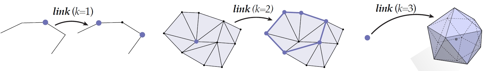
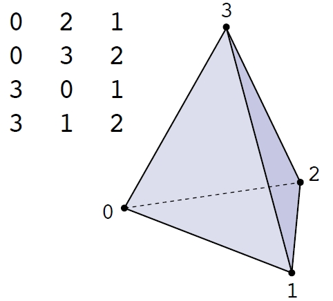
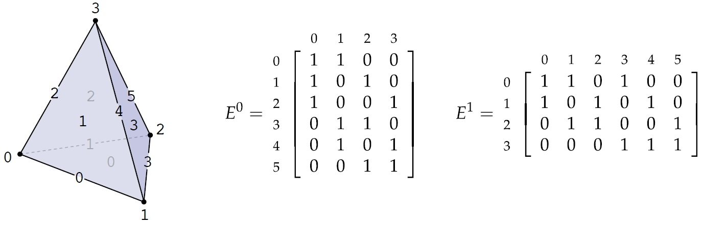
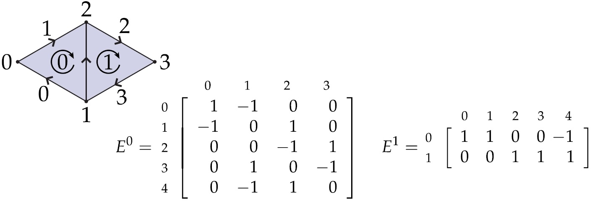
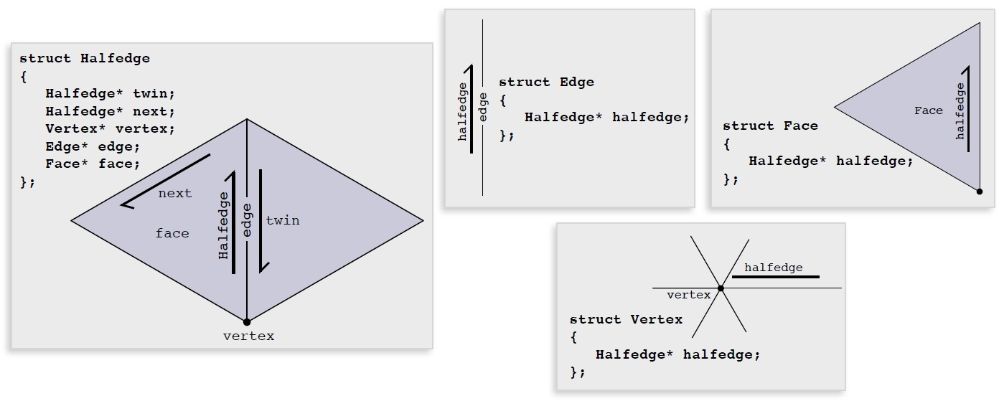
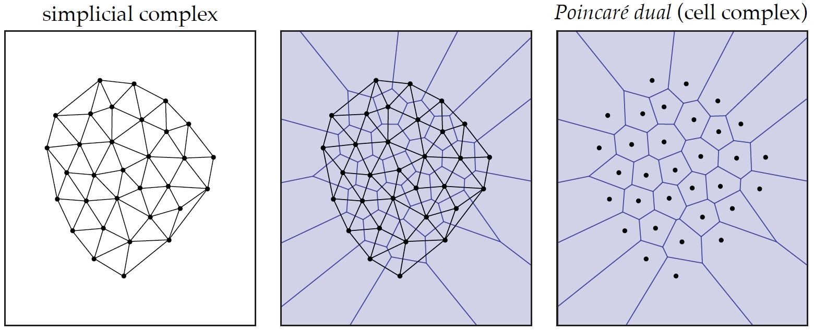

### 什么是流形（Manifold）？

流形是几何学中的一个基本概念，用于描述一种“良好”的空间，这种空间在局部看起来像欧几里得空间 $$\mathbb{R}^n$$。例如：

- 在二维 ($$n = 2$$) 情况下，球面和环面都是流形的例子，因为它们的小邻域与 $$\mathbb{R}^2$$ 相似。
- 如果一个空间存在一些区域，其局部特性不再类似于欧几里得空间（例如多个表面以无法展平的方式交汇），那么该空间是**非流形（non-manifold）**。

从形式上讲，一个拓扑（Topological）空间是**流形（manifold）**，当且仅当它满足以下条件：

1. 它是豪斯多夫（Hausdorff）空间（任何两个不同的点都有不相交的邻域）。
2. 每个点都有一个邻域与 $$\mathbb{R}^n$$ 同胚（homeomorphic）。

---

#### 单纯流形（Simplicial Manifold）

一个**单纯** $$k$$-复形（simplicial $$k$$-complex）被称为流形，当且仅当每个顶点的**链接**（link）与一个 $$(k-1)$$ 维球面同胚。

- **链接（Link）**：与某顶点相邻的单形（simplices）集合，不包括该顶点本身。
- 示例：
  - 当 $$k = 2$$ 时，顶点的链接应形成一个一维闭环。
  - 当 $$k = 3$$ 时，顶点的链接应类似于一个二维球面。

随着 $$k$$ 的增加，判断单纯复形是否是流形变得更加计算复杂。对于 $$k = 4$$，验证每个链接是否是一个三维球面是一个 NP 难问题。

---

#### 流形网格（Manifold Meshes）

**流形网格**（manifold mesh）是一种三角网格，需要满足以下条件：

1. 每条边恰好被两个三角形共享，或者被一个三角形共享（如果它位于边界）。
2. 每个顶点的邻域形成一个单一的三角形环，或在边界上形成一个“三角形扇形”。

流形网格具有以下优势，因为它们的邻域**结构可预测**，从而简化了数据结构和算法：

- 更容易管理相邻关系。
- 特别适合于图形学和模拟中的操作，例如细分（subdivision）和积分（integration）。

---

#### 流形网格的动机

流形网格提供了类似于二维图像中规则像素网格的简单性：

- 可预测的结构（例如，每个像素恰好有四个邻居）。
- 在离散微分几何（discrete differential geometry）中的计算特别鲁棒且高效。

---

### 拓扑数据结构（Topological Data Structures）

#### 邻接表（Adjacency List）

**邻接表（adjacency list）** 是一种轻量级数据结构，用于存储拓扑关系：

- **存储内容**：仅存储最高维单形（如二维网格中的三角形或三维网格中的四面体）。
- **优点**：
  - 简单且内存占用小。
  - 当只需访问最高维单形时效果很好。
- **缺点**：
  - 遍历低维单形（如边或顶点）计算代价较高，因为必须按需重建连接。
  - 访问单形的邻居可能较慢，因为需要额外计算。

#### 关联矩阵（Incidence Matrix）

**关联矩阵（incidence matrix）** 表示不同维度单形之间的关系，例如：

- 顶点与边的关系，
- 边与面的关系，
- 面与体积的关系。

矩阵的每个条目指示某单形（行）是否属于另一单形（列）：

- **优点**：
  - 明确表示维度之间的关系。
  - 使用矩阵运算查询非常方便。
- **缺点**：
  - 对于密集网格，矩阵可能非常大，如果许多条目为零，会浪费存储空间。

为提高效率，通常使用**稀疏矩阵（sparse matrix）** 数据结构：

1. **关联数组（associative array）**：将非零条目映射到其位置（如哈希表）。
2. **链表数组（array of linked lists）**：按行或列分组存储非零条目。
3. **压缩列格式（Compressed Column Format, CCF）**：
   - 紧凑地存储每列的值及其行索引。
   - 优化矩阵操作，如矩阵乘法。

#### 带符号关联矩阵（Signed Incidence Matrix）

**带符号关联矩阵（signed incidence matrix）** 扩展了基本关联矩阵，通过编码单形的**方向（orientation）**：

- 每个非零条目带有符号（$$+$$ 或 $$-$$），取决于两个单形的相对方向。
- 常用于**离散外微分（discrete exterior calculus）**，以定义散度（divergence）、梯度（gradient）和旋度（curl）等算子。

#### 半边数据结构（Half-Edge Data Structure）

**半边数据结构（half-edge data structure）** 是高效表示网格连接性的方法：

- **概念**：将网格中的每条边分为两个相对定向的**半边（half-edges）**。
- **存储内容**：
  - 顶点、边和面之间的关系通过半边的连接性表示。
  - 每个半边指向：
    - 它的**双生边（twin）**（同一条边的另一半），
    - 面内的下一条半边（next half-edge），
    - 它的起点顶点，
    - 它所属的面。
- **优点**：
  - 支持高效的网格元素遍历和修改。
  - 特别适合几何处理和离散微分几何。
- **挑战**：
  - 实现较复杂。
  - 比简单数据结构（如邻接表）占用更多内存，但在遍历密集操作中效率更高。

---

#### 数据结构比较表

| **数据结构**                                  | **优点**               | **缺点**                 | **最佳应用场景**           |
| --------------------------------------------- | ---------------------- | ------------------------ | -------------------------- |
| **邻接表（Adjacency List）**                  | 简单，内存占用低       | 边/邻居遍历速度慢        | 适用于存储受限的场景       |
| **关联矩阵（Incidence Matrix）**              | 显式表示关系，易于访问 | 在未优化稀疏性时尺寸较大 | 需要清晰表示所有关系时     |
| **带符号关联矩阵（Signed Incidence Matrix）** | 增加方向信息           | 与关联矩阵类似           | 离散外微分、基于物理的计算 |
| **半边（Half-Edge）**                         | 遍历快，操作高效       | 存储要求高，复杂度较高   | 网格操作、几何处理         |

---

### 对偶复形与庞加莱对偶性（Dual Complex and Poincaré Duality）

#### 原复形与对偶复形（Primal and Dual Complexes）

**原复形（primal complex）** 是由单形（simplices，如顶点、边、三角形等）组成的原始单纯复形（simplicial complex），它定义了几何或拓扑结构。而**对偶复形（dual complex）** 是通过“反转”这些单形的角色构造的：

- **原复形到对偶复形的映射（Primal to Dual Mapping）**：
  - 在原复形中，一个 $$k$$ 维单形对应于对偶复形中的一个 $$(n-k)$$ 维单元。
  - 例如，在二维三角网格中：
    - 一个原始顶点对应于一个对偶单元。
    - 一条原始边对应于一条对偶边。
    - 一个原始三角形对应于一个对偶顶点。
- **区别**：
  - 原复形强调几何。
  - 对偶复形强调连接性，适用于通量（flux）、循环（circulation）或积分（integration）等应用。

#### 单纯复形（Simplicial Complex）

**单纯复形（simplicial complex）** 是一组单形（点、边、三角形、四面体等）的集合，需满足以下条件：

1. **闭包性（Closure）**：如果一个单形属于复形，那么它的所有面也必须属于该复形。
2. **交集性（Intersection）**：复形中任意两个单形的交集要么是空集，要么是复形中的另一个单形。

这种结构在计算拓扑（computational topology）和离散几何（discrete geometry）中具有基础性作用，能够清晰高效地表示形状。

#### 庞加莱对偶（Poincaré Dual）

**庞加莱对偶（Poincaré dual）**是与单纯复形关联的对偶结构，形成一个**胞腔复形（cell complex）**，其中：

- 原复形中的每个单形对应一个补充维度的对偶单元。
- 原复形的连接性决定了对偶复形的连接性。

例如：

- 在二维单纯复形（如三角网格）中，对偶复形是一个图：
  - 节点表示三角形（2-单形）。
  - 边连接共享原复形边的三角形节点。

#### 庞加莱对偶性（Poincaré Duality）

庞加莱对偶性是代数拓扑中的一个核心结果，将流形的同调群（homology groups）与其对偶联系起来：

- 对于一个 $$n$$ 维可定向流形，$$k$$ 阶同调群 $$H_k$$ 同构于其对偶的 $$(n-k)$$ 阶上同调群 $$H^{n-k}$$。

这一对偶性对于理解流形拓扑至关重要，在物理学、几何学和拓扑优化中有广泛应用。

##### 自然界中的庞加莱对偶性（Poincaré Duality in Nature）

庞加莱对偶性在自然界和工程学中普遍存在，经常隐含在物理系统中：

1. **生物系统**：
   - 血管和树枝表现出优化流动和循环的对偶结构。
   - 神经网络反映了激活区域和连接性之间的对偶模式。
2. **物理学与材料**：
   - 电磁通量和循环遵循对偶模式（如法拉第定律、安培定律）。
   - 晶格中表现出原-对偶关系，例如沃罗诺伊图（对偶）与德劳内三角网（原复形）。
3. **地质与地理**：
   - 流域与排水盆地展现了山峰（原点）与山谷（对偶点）之间的对偶关系。
4. **建筑**：
   - 结构设计通常包含原始元素（如梁）与其对偶功能（如应力路径）。

利用庞加莱对偶性，研究者和工程师能够理解几何与功能之间的内在联系，从而实现优化设计并深入洞察自然系统。

### 总结

流形通过其“局部欧几里得”的特性，为拓扑学与几何学研究提供了基本框架。在现代应用中，流形结构广泛用于计算机图形学、物理模拟和拓扑优化，是理解复杂几何形状的基础工具。
