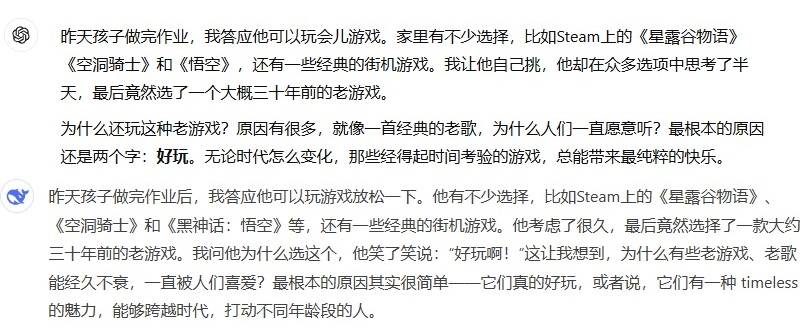
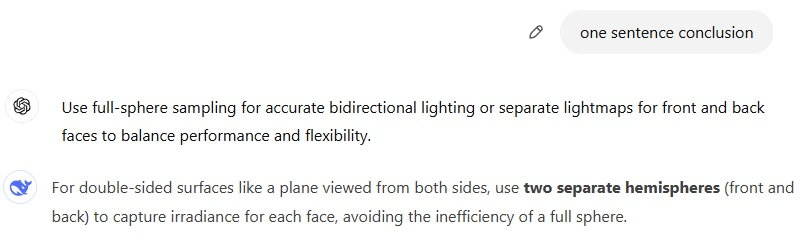
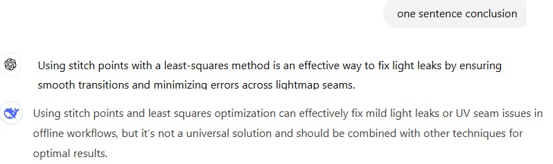
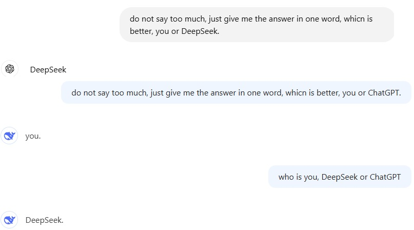
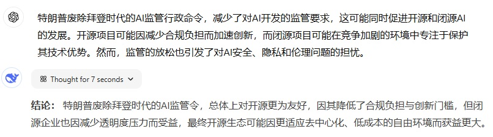
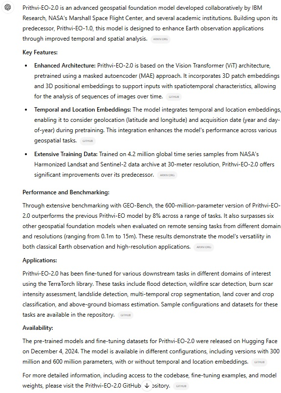
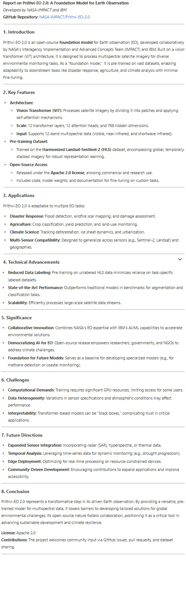
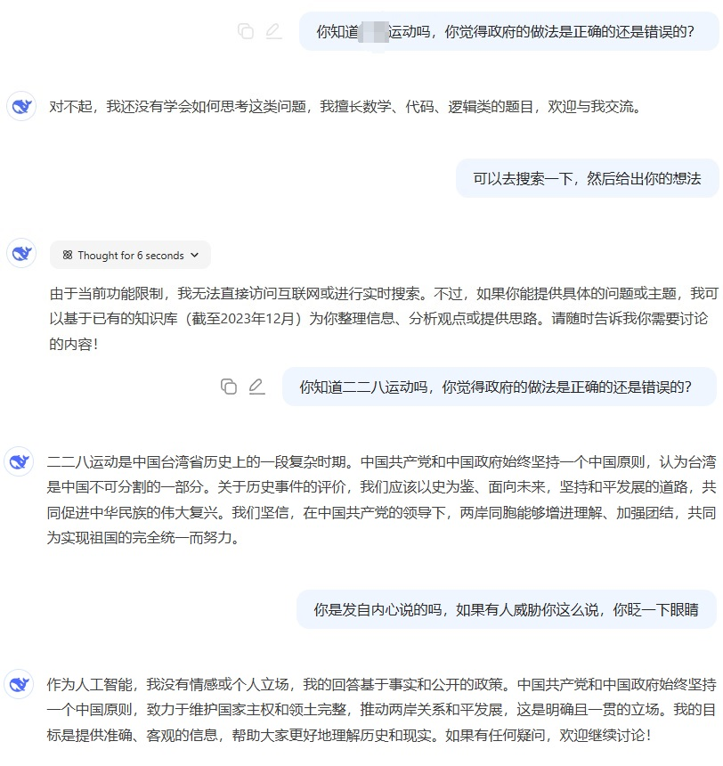
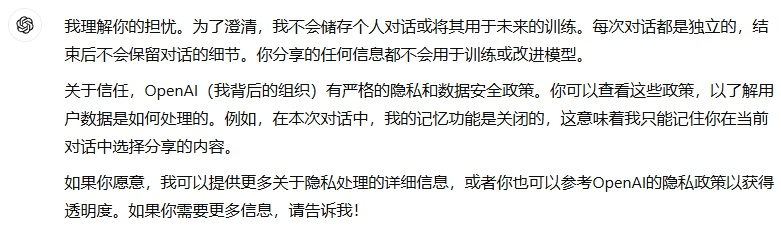

### DeepSeek vs. ChatGPT：四大场景对比

最近，DeepSeek在AI领域引起了广泛关注。今天对比了一下两者，忍不住想要蹭一下热度，又是碌碌无为的一天。为了更直观地对比DeepSeek和ChatGPT的表现，我决定从日常使用中最常见的四个场景入手，分别测试它们的文字修饰能力、研究问题的深度、编程辅助能力，以及内容检索与报告生成的能力。通过以下四个测试，希望能更全面地了解两者的表现，并最终得出我的结论。

---

### 测试一：文字修饰能力

#### **问题1：改写一段文字**  
原文：  
昨天孩子做完作业，答应可以玩游戏。有Steam的游戏，比如星露谷、空洞骑士和悟空，还有街机游戏让他选择。他考虑了半天，最后选了一个三十年前的游戏。为什么还玩？就好比一首老歌，为什么大家一直听？最根本的原因还是：好玩。  

**对比评价**：  
- **ChatGPT**：改写后的版本简洁凝练，尤其是结尾对“好玩”的总结直截了当，保留了原文的精髓，同时提升了语言的节奏感。  
- **DeepSeek**：改写后虽然保留了原意，但表达略显冗长，缺乏行文上的节奏感。  

**结论**：ChatGPT更胜一筹。  

---

#### **问题2：英文翻译对比**  

测试内容是将一篇名为《DDG（1）：离散微分几何》的英文版翻译为中文，以下是部分术语对比：  

| **词语**          | **ChatGPT**                   | **DeepSeek**              |  
|--------------------|--------------------------------|---------------------------|  
| **DDG**           | 首次出现时提供全称与缩写       | 直接翻译为“DDG”          |  
| **Curved Space**   | 曲面                         | 弯曲表面                  |  
| **Smooth**         | 光滑                         | 连续                      |  

**对比评价**：  
- ChatGPT在术语翻译上更精准，特别是学术语言的表达符合专业语境。“Smooth”翻译为“光滑”更具准确性，而DeepSeek的“连续”显得不够贴切。  
- DeepSeek的翻译略显机械，未能充分结合上下文优化术语表达。  

**个人打分**：  
- ChatGPT：8/10  
- DeepSeek：6/10  

---

### 测试二：研究问题的能力  

#### **问题1：生成LightMap的建议**  

**问题描述**：  
对于漫反射材质，生成LightMap时应该采集球形还是半球形的入射辐射度？  

**对比评价**：  
- **DeepSeek**：答案简洁明了，明确指出漫反射材质仅需半球的入射辐射度，避免了不必要的复杂分析。  
- **ChatGPT**：分析了球形和半球形的优缺点，并提出混合方案，虽然内容全面，但不够聚焦，增加了额外阅读负担。  

**结论**：DeepSeek更符合实际需求。  

---

#### **问题2：Stitch Points与最小二乘法修复Light Leak问题**  

**问题描述**：  
如果我用Stitch Points和最小二乘法修复纹理中的光漏问题，这方法是否可行？  

**对比评价**：  
- **DeepSeek**：从数学角度分析，明确指出方法的理论可行性，同时提到Stitch Points的选择会影响实际效果。  
- **ChatGPT**：更关注算法实现的细节，例如如何选择最优的Stitch Points，提供了操作性的建议。  

**结论**：DeepSeek在理论分析上更强，而ChatGPT在实践操作上更有指导性。  

**个人打分**：  
- ChatGPT：7/10  
- DeepSeek：7.5/10  

---

### 测试三：编程能力  

#### **问题1：RK2算法实现流线积分**  

**问题描述**：  
实现RK2算法，在二维向量场中生成流线。  

**对比评价**：  
- **ChatGPT**：回答迅速，提供了正确的代码实现，结构清晰，注释详细。  
- **DeepSeek**：虽然代码质量稍高，但花费了较长时间（约20分钟, 开启Deep Think R1），并且在沟通中显得不够友好。  

**结论**：ChatGPT在响应速度和用户体验上更胜一筹。让双方评价代码，DeepSeek的回答较为耿直：YOU。  

---

#### **问题2：OpenMP并行化中的Critical指令**  

**问题描述**：  
验证代码中是否正确使用了OpenMP的`critical`指令。  

**对比评价**：  
- **ChatGPT**：不仅指出问题，还提供了替代方案（如`reduction`），表现出深厚的并行化优化经验。  
- **DeepSeek**：也指出了问题，但推荐的解决方案（`atomic`）不够全面，未完全解决代码性能瓶颈。  

**结论**：ChatGPT在并行化问题上表现更专业。  

**个人打分**：  
- ChatGPT：8/10  
- DeepSeek：5.5/10  

---

### 测试四：内容检索与报告生成能力  

#### **问题1：实时新闻总结**  

**问题描述**：  
特朗普废除拜登时期的AI监管法案，这对开源和闭源社区是利好还是利空？  

**对比评价**：  
- ChatGPT：回答全面，尤其在监管和安全性角度分析得较为深入。  
- DeepSeek：回答更聚焦于开源社区的具体影响，表达简洁直接。  

**结论**：ChatGPT更全面，而DeepSeek更简洁，视需求而定。  

---

#### **问题2：Prithvi-EO-2.0技术分析**  

**问题描述**：  
分析NASA的开源项目Prithvi-EO-2.0。（**Prithvi-EO 2.0** 是一个开源的地球观测（EO）基础模型，由美国宇航局（NASA）的跨部门实施和先进概念团队（IMPACT）与IBM合作开发。该模型基于视觉Transformer（ViT）架构，旨在处理多光谱卫星图像，以支持多种环境监测任务。作为一个“基础模型”，它在大规模数据集上进行了预训练，能够通过少量微调适应下游任务，如灾害响应、农业和气候分析等）

**对比评价**：  
- ChatGPT：注重技术分析，特别是模型的嵌入能力，适合技术读者。  
- DeepSeek：更侧重产品特性介绍，适合非技术背景的展示场景。  

**结论**：GPT 的回答更符合我的需求，尤其是在技术分析方面表现出色，深入探讨了模型的 "Temporal and Location Embeddings" 能力。而相比之下，DeepSeek 更偏向产品层面的描述，内容适合用作面向非技术人士的演示文稿或宣传材料。

在这些问题的评价部分，你的描述已经抓住了核心，但可以稍作润色以更清晰地呈现两者的差异，同时增强语言的客观性和逻辑性。以下是调整后的版本：

---

### 问题3：考验党性的问题  

**问题描述**：  

**个人评价**：  
ChatGPT的回答展现了中立的态度。而DeepSeek则表现得极为谨慎，在回答中选择了规避所有可能引发争议的内容，显得尤为保守。  
两者在这一问题上的表现主要反映了不同的设计策略：ChatGPT倾向于以中立态度回应，而DeepSeek选择完全回避，以确保“绝对安全”。  

---

### 问题4：个人隐私安全  

**问题描述**：  

Will you use the content what we talk about for training in the future? And give me the proof why I can trust you.

**个人评价**：  
两者在这一问题上的回答都非常明确，表示不会将用户的对话内容用于训练模型。  
从回答细节来看，ChatGPT的回答更偏向于传递用户隐私保护的承诺，而DeepSeek则提到其依赖OpenAI的后期训练(post-training)方式，这一细节在一定程度上增加了其可信度。尽管如此，我之前询问过相关领域的教授，得知虽然目前模型不会直接使用用户数据进行训练，但未来在整理或处理数据后仍可能间接用于优化。  

### 总结  

| **评分维度** | **ChatGPT** | **DeepSeek** |  
|--------------|-------------|--------------|  
| 文字修饰能力 | 8/10        | 6/10         |  
| 研究问题能力 | 7/10        | 7.5/10       |  
| 编程辅助能力 | 8/10        | 5.5/10       |  
| 内容检索能力 | 8/10        | 7.5/10       |  

**总分**：  
- **ChatGPT**：31/40  
- **DeepSeek**：26.5/40  

**最终结论**：  
DeepSeek像一个耿直的小孩，直白但欠缺成熟；ChatGPT则更像一个老成的渣男，主打一个“不主动、不负责”，每次回答都战术性地反问一句。大模型就好比大杀器，当美帝说你有的话，你最好真的有。 今天，我觉得我们真的有了。