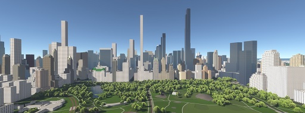
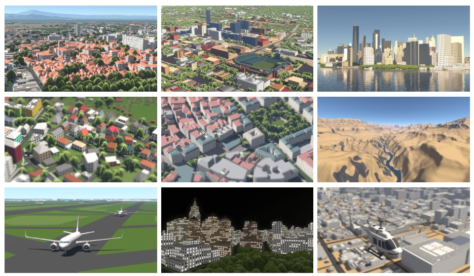
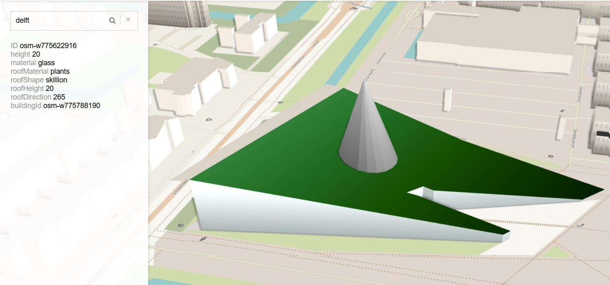
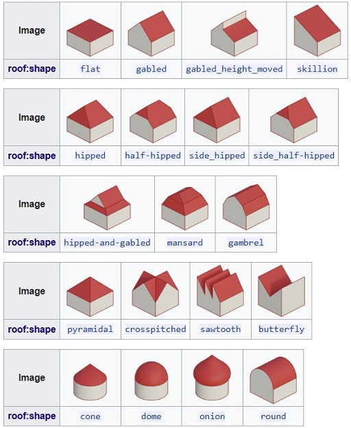
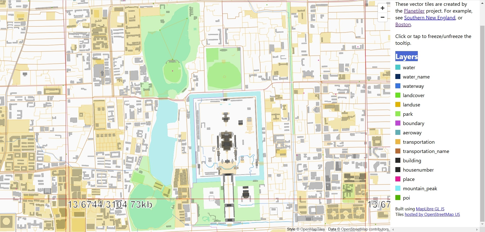
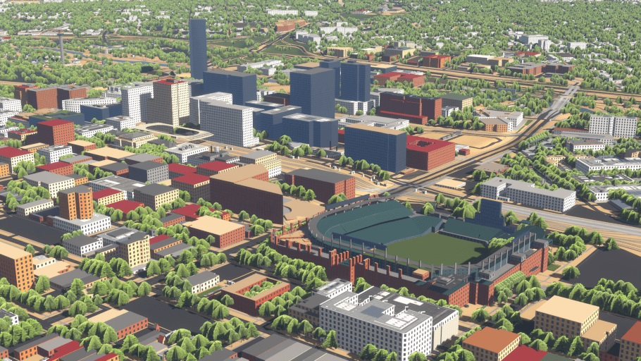

你有没有想过，可以用开源工具在网页上快速构建一个生动的 3D 城市地图？这篇文章介绍两个很有意思的项目：Streets.GL 和 OSMBuilding。它们都基于 OpenStreetMap 数据，把抽象的地图元素变成了立体的建筑、道路和树木。Streets.GL 注重高级渲染效果，比如动态光照和大气模拟，非常适合呈现细腻的 3D 地图场景。而 OSMBuilding 更轻量级，专注于建筑的简单可视化，非常方便嵌入各种地图应用中。无论是想展示复杂城市景观，还是实现快速互动地图，这两个工具都有自己的独特优势。

# Streets.GL

上周，我的同事分享了一个引人入胜的网页应用程序，名为 [Streets.GL](https://streets.gl/)。这个应用采用了独特的方法，我尽管时间有限，还是对其功能进行了探索。在如今对超逼真图形的追求中，我们往往忽略了成本和实用性。然而，Streets.GL 在渲染质量与全球3D建筑可视化之间找到了平衡，提供了一种实用且高效的替代方案。

Streets.GL 是一个开源的基于 Web 的 3D 地图渲染器，它利用 OpenStreetMap (OSM) 数据来创建动态、交互式的各种地理特征可视化，包括建筑、道路、小径和树木。这个项目由 **StrandedKitty** 开发，并于 2023 年 5 月 2 日正式发布。它旨在促进开放数据，同时为地图社区提供一个用于地图可视化验证的工具。

Streets.GL 使用 TypeScript 编写，并基于一个自定义的底层库，该库封装了 WebGL2 API 以实现渲染。它通过渲染图（render graph）来管理渲染管线，实时生成几何体以支持复杂的建筑形状，符合 Simple 3D Buildings 的数据模式（schema）。最初，数据来自公共的 Overpass API 实例。然而，自 2023 年 6 月 24 日起，Streets.GL 转向使用自托管的矢量瓦片集（vector tileset），以提高瓦片加载速度并减少对公共服务器的压力。这一改动使得地图更新略有滞后，因为瓦片集每周刷新一次。

## 核心功能：

- **OSM 特征：** 准确渲染建筑、道路、树木等地图元素。
- **动态光照：** 支持可配置的时间段以显示光照效果。
- **全球地图搜索：** 使用 Nominatim 实现全球位置搜索。
- **实时航班信息：** 显示地图中的实时航班数据。
- **具有 LOD 的地形：** 根据缩放级别调整地形细节。
- **高级渲染：** 使用延迟着色（deferred shading）、基于物理的渲染（Physically Based Rendering, PBR）、时间抗锯齿（Temporal Anti-Aliasing, TAA）以及环境光遮蔽（ambient occlusion）、景深（depth of field）、屏幕空间反射（screen-space reflections）和泛光（bloom）等效果。
- **大气渲染：** 提供逼真的空气透视和大气效果。

尽管该项目自 2023 年 9 月 24 日后未再更新，但 Streets.GL 仍是一个可用于 3D 可视化 OSM 数据的宝贵工具。用户可以在 [streets.gl](https://streets.gl) 在线体验该应用，并在 GitHub 上查看其源码。

---

## OSMBuilding

OSM Buildings 是一个开源的 JavaScript 库，用于在 2D 和 3D 中可视化 OpenStreetMap (OSM) 的建筑几何数据。它让开发者可以高效地将丰富、交互式的城市景观添加到网络地图中。

### 核心功能：

**1. 兼容性：**

- **经典 2.5D 版本：** 针对较旧的硬件设计，支持与 Leaflet 和 OpenLayers 2 的集成，并提供阴影模拟功能。
- **现代 3D 版本：** 针对现代硬件进行了优化，能够处理大型数据集，并使用 GLMap 进行渲染和事件处理。

**2. 可定制性：**

- 开发者可以根据项目需求修改如颜色、高度和屋顶形状等属性。

**3. 集成性：**

- 与多种地图服务兼容，支持自定义地图瓦片和 GeoJSON 数据源。

### 数据处理管线

OSMBuilding 使用 GeoJSON 数据，通过以下步骤生成 3D 渲染的三角网格：

1. **加载 GeoJSON 数据：**

   - 遍历 `geojson.features` 数组中的每个特征。

2. **处理每个特征：**

   - 将每个特征传入 `triangulate` 函数，生成 3D 几何数据。

3. **基础网格（通过 `addBuilding` 实现）：**

   - **几何转换：** 将特征的 2D 经纬度转换为本地 3D 坐标。
   - **生成基础：** 使用三角化算法（如 `earcut`）为建筑的地面轮廓生成三角网格。
   - **拉伸墙体：** 通过将基础与建筑指定高度的顶点相连生成垂直墙体。

4. **屋顶网格（通过 `createRoof` 实现）：**

   - **解释屋顶属性：** 使用高度、形状和方向等属性确定屋顶顶点。
   - **生成屋顶形状：** 根据屋顶形状（如平顶或单坡屋顶）构建三角网格。

5. **合并几何体：**

   - 将基础、墙体和屋顶的顶点与索引合并到一个共享的几何缓冲区。

6. **渲染 3D 网格：**

   - 将合并后的三角网格发送到 WebGL 或 Three.js 等渲染引擎。

### Simple 3D Buildings Schema

[Simple 3D Buildings](https://wiki.openstreetmap.org/wiki/Simple_3D_Buildings) 数据模式规范了 OSM 中的 3D 属性，通过定义建筑的三维特性提升了可视化效果。

#### 核心组件：

1. **建筑轮廓 (`building=*`)：**

   - 表示建筑的地面轮廓。
   - 包括地址、名称、总高度和运营方等属性。

2. **建筑部件 (`building:part=*`)：**

   - 指定具有不同物理特征的建筑部分。
   - 支持复杂结构的详细建模。

3. **高度属性：**

   - `height=*`：建筑或部件的总高度。
   - `min_height=*`：距离地面的起始高度。
   - `building:levels=*`：地面以上的层数。
   - `roof:levels=*`：屋顶内的层数。

4. **屋顶属性：**

   - `roof:shape=*`：指定屋顶形状（如平顶、双坡）。
   - `roof:height=*`：屋顶的垂直高度。
   - `roof:material=*`：屋顶材料（如瓦片、金属）。
   - `roof:orientation=*`：特别用于不对称屋顶的方向。

5. **材料和颜色属性：**

   - `building:material=*` 和 `building:colour=*`：定义建筑立面的主要材料和颜色。
   - `roof:material=*` 和 `roof:colour=*`：指定屋顶材料和颜色。

通过使用此数据模式，OSM 贡献者可以提升数据质量，实现更丰富的可视化和城市分析。

---

### Planet OSM

Planetiler 是一个高性能工具，用于从 OSM 等地理数据集生成矢量瓦片。它以速度和效率为核心设计，可在单台机器上于数小时内生成全球地图。工具输出的数据以 protobuf 格式存储，分为水体、建筑和交通等层。

支持 OSMBuilding 的生产应用可拓展出众多场景，Cesium 利用 OSM 数据便是其中的一个案例。然而，OSMBuilding 在 2020 年曾对 Cesium 的商标 “Cesium OSM Buildings” 提出担忧，认为其可能与自身的开源项目混淆。

---

### 其他功能

#### Streets.GL 中的实例对象

Streets.GL 支持对常见特征使用实例化对象。例如，它可以在标记为 "plant" 的区域中实例化绘制树模型。

#### 地形

Streets.GL 使用来自 ArcGIS Online 服务的高度图生成详细的 3D 地形。

#### 渲染

其渲染管线结合了高级技术，包括基于物理的延迟着色 (PBR)、时间抗锯齿 (TAA)、逼真的大气效果和航空透视渲染。

---

## 结论

Streets.GL、OSMBuilding 及相关工具展现了开源技术与地理空间可视化的强大结合。通过利用像 Simple 3D Buildings 这样的详细数据模式、高级渲染管线以及高效的数据工具（如 Planetiler），这些项目为理解和交互城市景观提供了直观的方法。它们共同推动了 GIS 领域的边界，使地理数据变得易于访问并在多种应用中更加引人注目。随着这些工具的不断发展，它们有望在城市规划和实时 3D 制图等领域推动创新。
