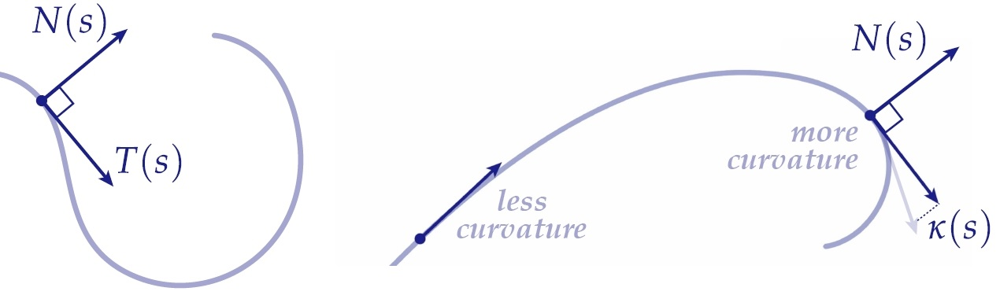

### 探索曲率

**Continuous curve**（连续曲线）是数学中的一个基本概念，广泛应用于从物理到计算机图形学等多个领域。理解它的属性，如**tangent**（切向量）、**normal**（法向量）和**curvature**（曲率），可以为研究其几何特性和行为提供重要见解。让我们深入探讨这些概念。

---

### 什么是连续曲线？

一个**parameterized curve**（参数化曲线）可以定义为一种映射：

$$
\gamma(s): [0, L] \to \mathbb{R}^2
$$

其中：

- **s** 是参数，通常表示弧长，定义在区间 $$[0, L]$$ 内。
- $$\gamma(s) = (x(s), y(s))$$ 表示曲线上某一点的位置。

---

### 曲线的切向量

**Tangent vector**（切向量）表示曲线在特定点 $$\gamma(s)$$ 的方向。它定义为曲线对参数 $$s$$ 的导数：

$$
T(s) = \frac{d}{ds} \gamma(s) = \left(\frac{dx}{ds}, \frac{dy}{ds}\right)
$$

如果曲线是**arc-length parameterized**（弧长参数化）的（即 $$s$$ 直接表示曲线上的距离），

则切向量指向曲线在点 $$\gamma(s)$$ 的运动方向，是理解曲线几何特性的关键工具。

---

### 曲线的法向量

**Normal vector**（法向量）垂直于切向量，表示曲线在特定点的“侧向”方向。在二维空间中，法向量通过对切向量进行四分之一转（逆时针旋转90°）获得。这可以通过**rotation operator**（旋转运算符）实现：

$$
\mathcal{R}(x, y) = (-y, x)
$$

因此，对于切向量 $$T(s) = (T_x(s), T_y(s))$$，法向量 $$N(s)$$ 为：

$$
N(s) = (-T_y(s), T_x(s))
$$

切向量和法向量满足以下关系：

- 它们是正交的：$$T(s) \cdot N(s) = 0$$。
- $$T(s)$$ 表示曲线运动的方向，$$N(s)$$ 表示与之垂直的方向。

---

### 曲线的曲率

**Curvature**（曲率）量化曲线在某点处的弯曲程度。它定义为切向量 $$T(s)$$ 相对于弧长参数 $$s$$ 的变化率：

$$
\kappa(s) = \left\|\frac{dT(s)}{ds}\right\|
$$

简单来说，曲率衡量的是沿曲线移动时切向量方向变化的快慢。

#### 几何解释

- **高曲率**：曲线弯曲得很急。
- **低曲率**：曲线几乎是直的。
- 对于半径为 $$r$$ 的**circle**（圆），曲率在所有点上是恒定的：$$\kappa = \frac{1}{r}$$。

#### 带符号曲率

在二维空间中，曲率也可以带有**sign**（符号）以表示弯曲的方向：

- **正曲率**：曲线向逆时针方向弯曲。
- **负曲率**：曲线向顺时针方向弯曲。

带符号曲率通常计算为：

$$
\kappa(s) = \frac{\det(\gamma'(s), \gamma''(s))}{\|\gamma'(s)\|^3}
$$

其中 $$\det(\gamma'(s), \gamma''(s))$$ 是切向量和二阶导数向量的行列式，反映了弯曲方向的取向。

---

### 关系总结

1. **Tangent Vector $$T(s)$$**：指示运动方向。
2. **Normal Vector $$N(s)$$**：垂直于 $$T(s)$$，描述侧向方向。
3. **Curvature $$\kappa(s)$$**：衡量曲线的弯曲程度。

这些要素共同构成研究和分析曲线几何的核心工具，可用于从机器人路径规划到动态系统研究的多种应用。

---

### 离散曲率

**Discrete curve**（离散曲线）是指由一系列顶点 $$\{\gamma_i\}$$ 组成的分段线性参数化曲线，这些顶点通过直线段相连。与光滑曲线不同，离散曲线没有连续的切向量或曲率，这在定义曲率时带来了挑战。如果直接将光滑曲线的曲率定义应用于离散曲线，则会导致曲率值在直线段上为零（无弯曲），而在尖角处趋于无穷大。

为了解决这个问题，我们采用基于离散几何概念的**曲率近似方法**。

---

#### 转角

定义离散曲率的一种方法是通过曲线中每个顶点的**转角**（turning angle）。对于某一顶点 $$\gamma_i$$，转角定义为向量 $$(\gamma_i - \gamma_{i-1})$$ 和 $$(\gamma_{i+1} - \gamma_i)$$ 之间的夹角：

$$
\theta_i = \text{angle}(\gamma_i - \gamma_{i-1}, \gamma_{i+1} - \gamma_i).
$$

在离散曲线中，顶点 $$i$$ 的曲率可以近似为转角归一化后的值，归一化的方式可以是以顶点间的弧长为基准。为简化表达，可以将曲率直接定义为转角：

$$
\kappa_i = \theta_i.
$$

---

#### 数学意义与几何解释

这种定义形式描述了**曲线长度的变化**由于某种扰动 $$\eta(s)$$ 的影响。进一步解释这种概念对于离散曲线中的曲率分析具有重要意义。以下是此概念的核心要点：

1. **局部形状变化**：转角 $$\theta_i$$ 捕捉了顶点周围曲线弯曲的程度，与连续曲线上的曲率概念在局部意义上相一致。
2. **弧长归一化**：通过标准化转角（例如以局部弧长为基准），可使曲率更能反映曲线局部几何特性。
3. **离散到连续的过渡**：这种曲率近似方法在网格细化（细分点数增多）时，可以渐近逼近连续曲线的曲率。

---

### 曲线长度变化

给定一个光滑的参数化曲线 $$\gamma(s)$$，我们考虑通过一个光滑函数 $$\eta(s)$$ 对曲线进行扰动，使得原始曲线被修改为：

$$
\gamma_\epsilon(s) = \gamma(s) + \epsilon \eta(s),
$$

其中 $$\epsilon$$ 是一个小参数。目标是评估曲线在 $$\epsilon = 0$$ 时长度的变化。

---

#### 长度泛函

扰动后的曲线 $$\gamma_\epsilon(s)$$ 的长度为：

$$
\text{Length}(\gamma_\epsilon) = \int_0^{L} \|\gamma_\epsilon'(s)\| \, ds.
$$

对长度泛函相对于 $$\epsilon$$ 求导，并在 $$\epsilon = 0$$ 处求值，得到长度的变化：

$$
\frac{d}{d\epsilon}\Big|_{\epsilon=0} \text{Length}(\gamma_\epsilon) = -\int_0^L \langle \eta(s), \kappa(s)N(s) \rangle \, ds,
$$

其中：

- $$\eta(s)$$ 是表示曲线变形的扰动函数；
- $$\kappa(s)$$ 是曲线在每一点的曲率；
- $$N(s)$$ 是曲线的单位法向量；
- $$\langle \cdot, \cdot \rangle$$ 表示 $$\mathbb{R}^2$$ 中的点积。

---

#### 几何解释

这一公式揭示了长度变化取决于以下两个因素：

1. 扰动 $$\eta(s)$$ 在法向方向 $$N(s)$$ 上的**投影**；
2. 曲线的**曲率** $$\kappa(s)$$。

因此，最迅速减少长度的运动为 $$\eta = \kappa N$$。

---

### 离散长度变化与转角

在离散设置中，这一分析可以通过曲线顶点位置的梯度（离散长度的变化率）表达。设离散曲线的顶点为 $$\{\gamma_i\}$$，总长度为：

$$
\text{Length}(\gamma) = \sum_{i=1}^n \|\gamma_i - \gamma_{i-1}\|.
$$

#### 转角

顶点 $$\gamma_i$$ 处的转角 $$\theta_i$$ 是相邻边之间的夹角：

$$
\theta_i = \text{angle}(\gamma_i - \gamma_{i-1}, \gamma_{i+1} - \gamma_i).
$$

#### 长度梯度

在每个顶点 $$\gamma_i$$，长度的梯度 $$\nabla_{\gamma_i} \text{Length}(\gamma)$$ 可表示为：

$$
\nabla_{\gamma_i} \text{Length}(\gamma) = \frac{\gamma_i - \gamma_{i-1}}{\|\gamma_i - \gamma_{i-1}\|} + \frac{\gamma_i - \gamma_{i+1}}{\|\gamma_{i+1} - \gamma_i\|}.
$$

该梯度可从几何角度理解为转角 $$\theta_i$$ 和单位法向量 $$N_i$$ 的函数。梯度最终化简为：

$$
\nabla_{\gamma_i} \text{Length}(\gamma) = 2 \sin\left(\frac{\theta_i}{2}\right) N_i,
$$

其中：

- $$\theta_i/2$$ 是转角的一半；
- $$N_i$$ 是顶点 $$i$$ 的单位法向量，方向取决于曲线的整体取向。

该梯度与法向上的曲率成正比，从而我们得到离散曲率的一个等效定义：

$$
\kappa_i^B = 2 \sin\left(\frac{\theta_i}{2}\right).
$$

---

### 两者的关系

当 $$\theta_i$$ 很小时（即曲线弯曲较小）：

$$
\kappa_i^B \approx \theta_i,
$$

因为 $$\sin(\theta_i / 2) \approx \theta_i / 2$$ 当 $$\theta_i$$ 足够小时。

这表明，**长度变化曲率**（$$\kappa_i^B$$）是对**转角曲率**（$$\kappa_i^A$$）的精细化和尺度调整。特别是在离散曲线长度梯度分析中，$$\kappa_i^B$$ 提供了一种更有用的形式。

---

#### 平滑曲线的斯坦纳公式

**斯坦纳公式（Steiner Formula）** 提供了曲线几何与其在法线方向上偏移时长度变化之间的强大联系。具体解释如下：

如果一个平滑曲线 $$\gamma$$ 在**法线方向**上以恒定距离 $$\epsilon$$ 偏移，则新曲线的长度可以表示为：

$$
\text{Length}(\gamma + \epsilon N) = \text{Length}(\gamma) - \epsilon \int_0^L \kappa(s) \, ds.
$$

##### 关键见解：

1. **偏移运动**：沿法线方向的偏移对曲线长度的影响与**总曲率**（即 $$\kappa(s)$$ 在弧长上的积分）成正比。
2. **几何意义**：如果曲线弯曲较多（曲率高），偏移会显著减少曲线的长度；而对于平直或接近直线的曲线，长度变化很小。

---

##### 离散场景

在离散曲线中，需要对曲线的每个边缘段进行偏移。然而，如何一致地连接这些新偏移的段是一个挑战。以下是几种自然的处理策略：

###### A. 半径为 $$\epsilon$$ 的圆弧连接：

- 每个顶点之间用小圆弧连接，模仿原始平滑曲线的曲率。
- 这种方法能够较好地逼近平滑曲线的行为，包括曲率对总体长度的影响。

###### B. 直线连接：

- 使用直线连接偏移段。
- 实现更简单，但对平滑曲率效果的逼近较差。

###### C. 延长边直至相交：

- 延长偏移的边，直到它们相交，形成段之间的自然交点。
- 这种方法反映了许多工程应用中处理离散曲线的方式，但可能引入额外的尖锐特征。

---

##### 离散曲线长度变化公式

以下方程表示了离散曲线在不同曲率逼近下的**长度变化**，采用了转角 $$\theta_i$$ 及其三角变体：

$$
\text{Length}_A = \text{Length}(\gamma) - \epsilon \sum_i \theta_i
$$

$$
\text{Length}_B = \text{Length}(\gamma) - \epsilon \sum_i 2 \sin\left(\frac{\theta_i}{2}\right)
$$

$$
\text{Length}_C = \text{Length}(\gamma) - \epsilon \sum_i 2 \tan\left(\frac{\theta_i}{2}\right)
$$

---

##### 小角 $$\theta_i$$ 的近似

对于小角度 $$\theta_i$$，我们可以近似为：

$$
\sin\left(\frac{\theta_i}{2}\right) \approx \tan\left(\frac{\theta_i}{2}\right) \approx \frac{\theta_i}{2}.
$$

在这种情况下，三种公式在转角较小时几乎等价。然而，对于较大的转角，$$\sin(\theta_i / 2)$$ 和 $$\tan(\theta_i / 2)$$ 提供了更精确的逼近。

---

#### 密切圆

**密切圆（Osculating Circle）** 是在某一点上最接近平滑曲线的圆。

- 其半径与曲线的曲率半径相同，即它捕捉了曲线的局部弯曲行为。
- 曲线的**曲率** $$\kappa$$ 是密切圆半径的倒数：

$$
\kappa = \frac{1}{R}.
$$

这种几何方法以简单直观的方式揭示了曲率是“弯曲紧密程度”的度量。看到这是否想起当年线积分的求解曲率的高数题呢。

在离散设置中，与此类似的概念是通过离散曲线的三个连续顶点定义的**外接圆（Circumcircle）**：

$$
\kappa_i^D = \frac{1}{R_i} = \frac{2 \sin(\theta_i)}{\omega_i},
$$

其中 $$R_i$$ 是三个顶点 $$v_{i-1}, v_i, v_{i+1}$$ 所构成外接圆的半径。

---

##### 与其他曲率近似的比较

Osculating Circle 方法与先前的离散曲率近似（如 Turning Angle 或 Length Variation）不同，其优势在于直接与几何属性相连：

1. **Turning Angle**：测量方向变化的速率，但不依赖显式的几何构造。
2. **Length Variation**：与曲线偏移时的长度变化相关，通常会在多个顶点上进行平滑处理。
3. **Osculating Circle**：提供了基于局部弯曲半径的直接几何测量，与平滑的几何设置平滑连接。

---

#### 曲率流的关键性质

研究基于曲率的曲线流动时，有一些关键性质可以帮助理解其行为：

1. **Total Curvature**
   **性质**：在流动过程中，**总曲率 (Total Curvature)** 保持不变。

   - 对于平滑曲线，总曲率表示为 $$\int_0^L \kappa(s) \, ds$$。
   - 在离散情况下，总曲率通常表示为 $$\sum_i \kappa_i$$（基于某种离散曲率定义）。
   - 这种守恒性与曲线的内在几何性质密切相关。

2. **Drift**
   **性质**：曲线的 Center of Mass 在流动过程中不会偏离原点。

   - 对于参数化曲线 $$\gamma(s)$$，Center of Mass 表示为：

     $$
     \text{Center of Mass} = \frac{1}{L} \int_0^L \gamma(s) \, ds。
     $$

   - Drift-Free 性质保证了曲率流导致的曲线运动不会引入整体系统的平移偏移。

3. **Roundness (Stationary for Circular Curves)**
   **性质**：在尺度变换的意义下，圆形曲线在曲率流中是稳定的。
   - Circular Curves 在曲率流中表示平衡态，因为其曲率 $$\kappa = 1/r$$ 在每个点上均为常数。
   - 这意味着圆形仅在流动过程中均匀收缩或膨胀，但保留几何形状。
   - 圆的半径可能随时间改变，但整体形状始终保持为完美的圆形。

|              | Total | Drift | Round |
| :----------- | :---: | ----: | ----: |
| $$\kappa^A$$ |   √   |     × |     × |
| $$\kappa^B$$ |   ×   |     √ |     × |
| $$\kappa^D$$ |   ×   |     × |     √ |

没有任何一种离散曲率可以同时捕获平滑流的所有三个性质。

### 结论

曲率及其相关属性（如 Tangent Vectors、Normal Vectors 和 Curvature Flows）提供了理解曲线几何的基本框架，无论在平滑还是离散的设置下。诸如 Steiner Formula、Osculating Circle 和曲率近似等关键概念，有助于量化和分析曲线的弯曲及运动。虽然没有任何单一离散曲率能够完全捕捉平滑流的所有性质，这些工具在机器人学、计算机图形学等领域，为深入探索和应用几何原理提供了坚实的基础。
