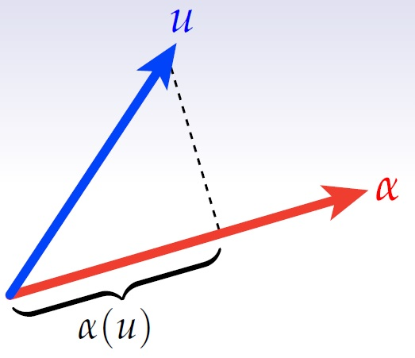
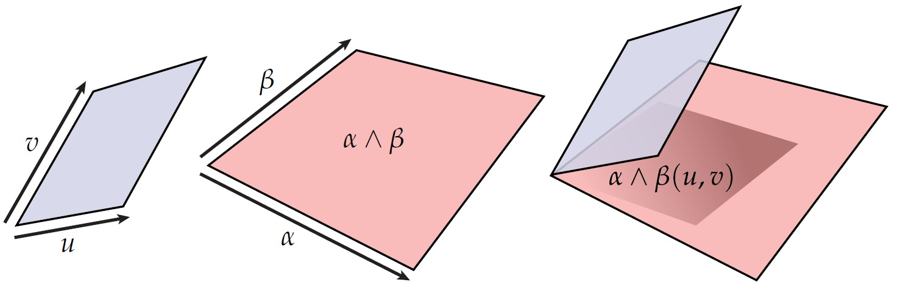
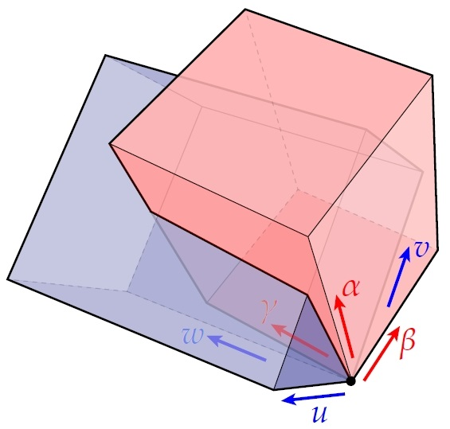
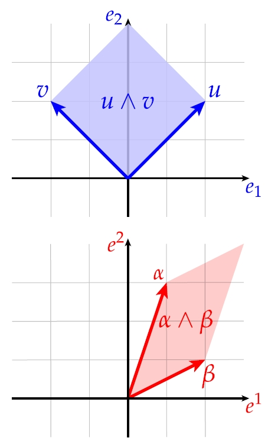
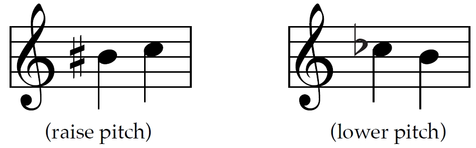

### **外代数中的 k-Forms**

**k-form** 是 **exterior algebra**（外代数）中的一个基础概念，它将测量的概念（例如长度、面积或体积）推广到 $$k$$ 维空间。它是一个**完全反对称的、多线性的映射**，用于量化 $$k$$ 维“体积”。这一点使它区别于 **k-vectors**，后者是这些体积的表示。

以下是一个帮助理解的类比：

- **k-vector** 描述形状（例如向量的跨度或几何区域）。
- **k-form** 则是用于测量这些形状的工具，就像尺子测量长度或量杯测量体积一样。

---

### **向量与协向量：对偶关系**

向量（vectors）和协向量（covectors）具有一种对偶关系，就像测量系统中的对应物：

- **向量** 表示既有方向又有大小的量。
- **协向量** 是测量这些向量的“工具”，在数学上与向量是对偶的。

####  **对偶空间** $$V^*$$：

给定一个向量空间 $$ V $$，其对偶空间 $$ V^* $$ 由线性映射 $$ \alpha: V \to \mathbb{R} $$ 组成。其结构与 $$ V $$ 类似：

1. **加法**：$$ (\alpha + \beta)(v) = \alpha(v) + \beta(v) $$
2. **标量乘法**：$$ (c\alpha)(v) = c \cdot \alpha(v) $$

---

### **Flat 与 Sharp 运算符：连接向量与协向量**

在像 $$ \mathbb{R}^n $$ 这样的空间中，**flat ($$ \flat $$)** 和 **sharp ($$ \sharp $$)** 运算符使用度量张量 $$ g $$ 在向量和协向量之间进行转换。

1. **Flat ($$ \flat $$)**：将向量 $$ v $$ 转换为协向量 $$ v^\flat $$：

$$
v^\flat(w) = g(v, w),
$$

其中 $$ g(v, w) $$ 是内积。

2. **Sharp ($$ \sharp $$)**：将协向量转换回向量 $$ \alpha^\sharp $$：

$$
   g(\alpha^\sharp, w) = \alpha(w).
$$

---

### 示例：在 $$ \mathbb{R}^2 $$ 中的计算

设度量张量 $$ g = \begin{bmatrix} 2 & 0 \\ 0 & 1 \end{bmatrix} $$ 和向量 $$ v = \begin{bmatrix} 3 \\ 4 \end{bmatrix} $$。

#### **应用 $$ \flat $$：**

协向量 $$ v^\flat = g v $$：

$$
v^\flat = \begin{bmatrix} 6 \\ 4 \end{bmatrix}.
$$

#### **应用 $$ \sharp $$：**

向量 $$ \alpha^\sharp = g^{-1} \alpha $$：

$$
\alpha^\sharp = \begin{bmatrix} 3 \\ 4 \end{bmatrix},
$$

可以还原原始向量 $$ v $$。

---

### **内积验证**

验证内积的一致性：

1. 使用 $$ g $$ 直接计算：

   设 $$ u = \begin{bmatrix} 1 \\ 2 \end{bmatrix} $$，则：
   
$$
   \langle v, u \rangle = v^T g u = \begin{bmatrix} 3 & 4 \end{bmatrix}
   \begin{bmatrix} 2 & 0 \\ 0 & 1 \end{bmatrix}
   \begin{bmatrix} 1 \\ 2 \end{bmatrix} = 10.
$$

2. 使用 $$ v^\flat $$ 计算：

$$
   v^\flat(u) = \begin{bmatrix} 6 & 4 \end{bmatrix} \begin{bmatrix} 1 \\ 2 \end{bmatrix} = 6 \cdot 1 + 4 \cdot 2 = 10.
$$

两种方法结果一致，验证了运算的正确性。对向量应用 flat 等价于求内积；用 sharp 求内积等价于应用原始协向量。

---

## k-Forms（k-形式）

|                      | **Primal（原空间）** | **Dual（对偶空间）** |  
| -------------------- | ------------------- | ------------------- |  
| **Linear Algebra（线性代数）**   | Vectors（向量）          | Covectors（共轭向量）     |  
| **Exterior Algebra（外代数）** | $$ k $$-vectors（k-向量） | $$ k $$-forms（k-形式）  |  

我们现在可以定义**Covectors（共轭向量）**，它们是从向量到标量的线性映射。**Exterior Algebra（外代数）**允许我们通过向量构造$$ k $$-vectors，并结合这些思想，我们可以构建一个共轭向量的外代数，称为$$ k $$-forms（k-形式），它是多线性映射。

一个**1-form（1-形式）**可以被视为一个共轭向量$$ \alpha $$用来“测量”一个向量$$ u $$。其表示为函数应用$$ \alpha(u) $$。在分量形式中，这可以表示为：

$$
\alpha(\mu) := \sum_i \alpha_i \mu^i,
$$

其中$$ \alpha_i $$是共轭向量的分量，$$ \mu^i $$是向量的分量。

类似地，2-forms（2-形式）可以用来表示投影面积，3-forms（3-形式）可以用来表示投影体积。

例如，可以通过2-form$$ (\alpha \wedge \beta)(u, v) := \alpha(u)\beta(v) - \alpha(v)\beta(u) $$计算由两个向量$$ u $$和$$ v $$定义的平行四边形在平面上的投影面积，其中$$ \alpha $$和$$ \beta $$是共轭向量。

为了计算由三个向量$$ u $$、$$ v $$和$$ w $$定义的平行六面体在三共轭向量$$ \alpha $$、$$ \beta $$和$$ \gamma $$张成空间上的投影体积，可以使用3-form$$ \alpha \wedge \beta \wedge \gamma $$，其定义为：

$$
(\alpha \wedge \beta \wedge \gamma)(u, v, w) = \text{det}
\begin{bmatrix}
\alpha(u) & \alpha(v) & \alpha(w) \\
\beta(u) & \beta(v) & \beta(w) \\
\gamma(u) & \gamma(v) & \gamma(w)
\end{bmatrix}.
$$

这里的行列式表示被共轭向量$$ \alpha $$、$$ \beta $$和$$ \gamma $$“测量”后平行六面体的有向体积。

### k-Forms的概念化计算

通过行列式计算一个$$ k $$-form对$$ k $$个向量的值可以表示为：

$$
(\alpha_1 \wedge \alpha_2 \wedge \cdots \wedge \alpha_k)(u_1, u_2, \dots, u_k) := \text{det} \begin{bmatrix}
\alpha_1(u_1) & \alpha_1(u_2) & \cdots & \alpha_1(u_k) \\
\alpha_2(u_1) & \alpha_2(u_2) & \cdots & \alpha_2(u_k) \\
\vdots & \vdots & \ddots & \vdots \\
\alpha_k(u_1) & \alpha_k(u_2) & \cdots & \alpha_k(u_k)
\end{bmatrix}.
$$

这种形式允许通过行列式计算高维空间中的体积类量，从而建立代数结构与几何之间的清晰联系。

### k-Forms的反对称性

**k-Forms**的一个关键性质是其**反对称性**（Antisymmetry）。这意味着交换任意两个参数（无论是向量还是共轭向量）会反转结果的符号。例如，如果我们在一个$$ k $$-form$$ \alpha_1 \wedge \alpha_2 \wedge \cdots \wedge \alpha_k $$的计算中交换了两个向量$$ u_i $$和$$ u_j $$，则形式的值会变为其负值：

$$
(\alpha_1 \wedge \cdots \wedge \alpha_k)(u_1, \dots, u_i, \dots, u_j, \dots, u_k) = - (\alpha_1 \wedge \cdots \wedge \alpha_k)(u_1, \dots, u_j, \dots, u_i, \dots, u_k).
$$

这一性质反映了交换向量或共轭向量会反转由这些向量张成的平行多面体（或更高维几何体）的方向。如果任意两个向量线性相关，结果为零，因为体积塌缩为零。

---

## Dual Basis

在微分几何和外代数中，**dual basis**（对偶基）$$ e^1, e^2, \dots, e^n $$ 提供了一种自然的框架，用于以分量形式表示 covectors（协变向量或 1-forms）。一个 covector $$ \alpha $$ 可以表示为：

$$
\alpha = \alpha_1 e^1 + \alpha_2 e^2 + \cdots + \alpha_n e^n,
$$

其中，$$ \alpha_1, \alpha_2, \dots, \alpha_n $$ 是 $$ \alpha $$ 的分量，而 $$ e^1, e^2, \dots, e^n $$ 是对偶基的元素。对偶基的定义满足以下条件：

$$
e^i(e_j) = \delta^i_j,
$$

其中，$$ \delta^i_j $$ 是 **Kronecker delta**（克罗内克 delta 函数，$$ \delta^i_j = 1 $$ 当 $$ i = j $$，否则为 $$ 0 $$）。这一定义建立了基 $$ \{e_1, e_2, \dots, e_n\} $$ 与其对偶基 $$ \{e^1, e^2, \dots, e^n\} $$ 之间的对偶关系。

对偶基在将几何对象转化为代数表示中起着至关重要的作用。例如，它使得 covector $$ \alpha $$ 的分量可以通过以下方法轻松计算：$$ \alpha(e_j) = \alpha_j $$。这为在向量空间中操作几何和代数结构奠定了基础。

此外，对偶基作为 vectors 和 covectors 之间的桥梁，支持操作如收缩（contraction）、楔积（wedge products）以及从原空间到对偶空间的转换。它在理解几何与代数的交互中不可或缺。

## Example: Computing $$ (\alpha \wedge \beta)(u, v) $$

以下是使用示例逐步计算 $$ (\alpha \wedge \beta)(u, v) $$ 的过程：

### 已知：

- $$ u = 2e_1 + 2e_2 $$，
- $$ v = -2e_1 + 2e_2 $$，
- $$ \alpha = e^1 + 3e^2 $$，
- $$ \beta = 2e^1 + e^2 $$。

楔积 $$ \alpha \wedge \beta $$ 作用于 $$ u $$ 和 $$ v $$ 的定义为：

$$
(\alpha \wedge \beta)(u, v) = \alpha(u) \beta(v) - \alpha(v) \beta(u).
$$

### 逐步计算：

1. **计算 $$ \alpha(u) $$：**

$$
\alpha(u) = (e^1 + 3e^2)(2e_1 + 2e_2) = 2 \cdot 1 + 2 \cdot 3 = 2 + 6 = 8.
$$

2. **计算 $$ \beta(v) $$：**

$$
\beta(v) = (2e^1 + e^2)(-2e_1 + 2e_2) = 2 \cdot (-2) + 1 \cdot 2 = -4 + 2 = -2.
$$

3. **计算 $$ \alpha(v) $$：**

$$
\alpha(v) = (e^1 + 3e^2)(-2e_1 + 2e_2) = 1 \cdot (-2) + 3 \cdot 2 = -2 + 6 = 4.
$$

4. **计算 $$ \beta(u) $$：**

$$
\beta(u) = (2e^1 + e^2)(2e_1 + 2e_2) = 2 \cdot 2 + 1 \cdot 2 = 4 + 2 = 6.
$$

### 最终计算：

$$
(\alpha \wedge \beta)(u, v) = \alpha(u) \beta(v) - \alpha(v) \beta(u),
$$

$$
(\alpha \wedge \beta)(u, v) = 8 \cdot (-2) - 4 \cdot 6 = -16 - 24 = -40.
$$

### 结果：

$$
(\alpha \wedge \beta)(u, v) = -40.
$$

这一结果表示由 $$ u $$ 和 $$ v $$ 张成的有向面积，其大小由 $$ \alpha $$ 和 $$ \beta $$ 衡量。负号反映了相对于所选基的方向。

### Einstein Summation

**Einstein summation**（爱因斯坦求和）记号通过隐式对重复指标求和，使表达式更紧凑优雅。其约定如下：当一个指标在一个项中出现两次（一次为“上”标，即反变指标，另一次为“下”标，即协变指标）时，理解为对该指标的所有可能值求和。

例如，对于 2-form $$ \alpha \wedge \beta $$ 作用于两个 vectors $$ u $$ 和 $$ v $$，在 Einstein summation 记号中表示为：

$$
(\alpha \wedge \beta)(u, v) = \alpha_i \beta_j u^i v^j.
$$

其中：

- $$ \alpha_i $$ 和 $$ \beta_j $$ 是 covectors $$ \alpha $$ 和 $$ \beta $$ 的分量，
- $$ u^i $$ 和 $$ v^j $$ 是 vectors $$ u $$ 和 $$ v $$ 的分量，
- 重复指标 $$ i $$ 和 $$ j $$ 表示对它们的可能值隐式求和。

展开后，意味着：

$$
(\alpha \wedge \beta)(u, v) = \sum_{i,j} \alpha_i \beta_j u^i v^j.
$$

这一简洁的记号显著降低了高维空间或多项式表达式中的复杂性。

爱因斯坦（Albert Einstein）提出了这一思想，并著名地说道：  
**“If an index occurs twice in a term, we always perform summation over this index.”**

这一优雅的原则自此成为张量计算的基石，被广泛应用于微分几何、广义相对论以及理论物理等领域。

爱因斯坦求和法则的力量并不止于此——它还可以扩展到张量图（tensor diagrams），提供了一种直观且易于理解的方式来操作张量。理查德·费曼（Richard Feynman）曾幽默地设想了这种简化表示法的影响：  
**“Wouldn’t it be funny if this turns out to be useful, and the *Physical Review* would be all full of these funny-looking pictures?”**

事实证明，这些工具确实非常宝贵，并已成为研究数学和物理系统的必备方法。

### Sharp ($$ \# $$) 和 Flat ($$ \flat $$) 运算

**Sharp** 和 **Flat** 运算用于通过**度量张量**（metric tensor）升高或降低指标，在 vectors 和 covectors 之间进行转换。

1. **Flat ($$ \flat $$)**：使用度量 $$ g_{ij} $$ 将 vector $$ v^i $$ 转换为 covector $$ v_i $$：

$$
v_i = g_{ij} v^j.
$$

2. **Sharp ($$ \# $$)**：使用逆度量 $$ g^{ij} $$ 将 covector $$ \alpha_i $$ 转换为 vector $$ \alpha^i $$：

$$
\alpha^i = g^{ij} \alpha_j.
$$

这些运算依赖于由度量所编码的空间几何性质，为主空间和对偶空间之间提供了一个基本链接。类似于音乐中升降音符的交互，它们揭示了 vectors 和 covectors 的对偶本质。

---

总之，外代数中的 **k-形式（k-forms）** 提供了一种强大的工具，用于测量几何量，如面积、体积以及更高维的类比。通过使用 **协向量（covectors）** 定义 **k-形式**，我们弥合了代数结构与几何之间的鸿沟，使得量化 **k** 维体积成为可能。  
**k-形式** 的 **反对称性（antisymmetry）** 在捕捉方向性（orientation）方面起着至关重要的作用，同时确保测量结果能够反映几何结构的特性。深入理解 **向量（vectors）**、**协向量（covectors）** 以及 **平（flat）和锐（sharp）运算符** 之间的相互作用，可以进一步加深我们对这些对象 **对偶性（dual nature）** 的理解，强化几何与线性代数之间的联系。